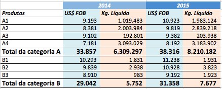

# Limpando dados

No dia a dia de quem trabalha com dados, infelizmente, é muito comum se deparar com dados formatados de um jeito bastante complicado de se manipular. Isso acontece pois a forma de se trabalhar com dados é muito diferente da forma de se apresentar ou visualizar dados. Resumindo: "olhar" dados requer uma estrutura bem diferente de "mexer" com dados. Limpeza de dados também é considerada parte da manipulação de dados.

## O formato "ideal" dos dados

É importante entender um pouco mais sobre como os dados podem ser estruturados antes de entrarmos nas funções de limpeza. O formato ideal para analisar dados, visualmente, é diferente do formato ideal para analisá-los de forma sistemática. Observe as duas tabelas a seguir:

```{r echo=FALSE, fig.cap='Tabela wide'}

```

```{r echo=FALSE, fig.cap='Tabela long'}
knitr::include_graphics("imagens/dados_long.png")
```

A primeira tabela é mais intuitiva para análise visual, pois faz uso de cores e propõe uma leitura natural, da esquerda para a direita. Utiliza, ainda, elementos e estruturas que guiam seus olhos por uma análise de forma simples. Já a segunda tabela é um pouco árida para se interpretar "no olho".

Há uma espécie de regra geral a qual diz que um dado bem estruturado deve conter uma única variável em uma coluna e uma única observação em uma linha.

Observando-se a primeira tabela, com essa regra em mente, podemos perceber que as observações de ano estão organizadas em colunas. Apesar de estar num formato ideal para análise visual, esse formato dificulta bastante certas análises sistemáticas. O melhor a se fazer é converter a primeira tabela a um modelo mais próximo o possível da segunda tabela.

Infelizmente, não temos como apresentar um passo a passo padrão para limpeza de dados, pois isso depende completamente do tipo de dado que você receber, da análise que você quer fazer e da sua criatividade em manipulação de dados. Mas conhecer os pacotes certos ajuda muito nessa tarefa.

Lembre-se: é muito mais fácil trabalhar no R com dados "bem estruturados", onde **_cada coluna deve ser uma única variável_** e **_cada linha deve ser uma única observação_**.

Na contramão da limpeza de dados, você provavelmente terá o problema contrário ao final da sua análise. Supondo que você organizou seus dados perfeitamente, conseguiu executar os modelos que gostaria, gerou diversos gráficos interessantes e está satisfeito com o resultado, você ainda precisará entregar relatórios finais da sua análise em forma de tabelas sumarizadas e explicativas, de modo que os interessados possam entender facilmente, apenas com uma rápida análise visual. Neste caso, que tipo de tabela seria melhor produzir? Provavelmente, quem for ler seus relatórios entenderá mais rapidamente as tabelas mais próximas do primeiro exemplo mostrado.

É importante aprender a estruturar e desestruturar tabelas de todas as formas possíveis.

Para exemplificar, veja algumas tabelas disponíveis no pacote `tidyverse`, ilustrando os diferentes tipos de organização nos formatos wide e long. Todas as tabelas possuem os mesmos dados e informações:

```{r message=FALSE, warning=FALSE}
library(tidyverse)
```

```{r}
table1
```

```{r}
table2
```

```{r}
table3
```

```{r}
table4a
```

```{r}
table4b
```

```{r}
table5
```

## Pacote tidyr

Apesar de existirem diversas possibilidades de situações que necessitem de limpeza de dados, a conjugação de três pacotes consegue resolver a grande maioria dos casos: `dplyr`, `tidyr`, `stringr`.

O pacote `tidyr` é mais um dos pacotes criados por Hadley Wickham. Este fato, por si só, já traz algumas vantagens: ele se integra perfeitamente com o `dplyr`, usando o conector `%>%`, e tem a sintaxe de suas funções bastante intuitiva.

```{r, echo = FALSE, message = FALSE}
library(tidyr)
```

```{r, eval = FALSE}
install.packages("tidyr")
library(tidyr)
?tidyr
```

O `tidyr` também tem suas funções organizadas em pequenos verbetes, onde cada um representa uma tarefa para organizar os dados. Os verbetes básicos que abordaremos são os seguintes:

* gather()
* separate()
* spread()
* unite()

Vale lembrar que tudo que for feito usando o `tidyr` é possível executar também usando o R base, mas de uma forma um pouco menos intuitiva. Caso queira entender como usar o R base pra isso, procure mais sobre as funções `melt()` e `cast()`.

```{r echo=FALSE, fig.cap='Tabela long'}
knitr::include_graphics("imagens/tidyr.png")
```

### Gather

A função `gather()` serve para agrupar duas ou mais colunas e seus respectivos valores (conteúdos) em pares. Assim, o resultado após o agrupamento é sempre duas colunas. A primeira delas possui observações cujos valores chave eram as colunas antigas e a segunda possui os valores respectivos relacionados com as colunas antigas. Na prática, a função gather diminui o número de colunas e aumenta o número de linhas de nossa base de dados.

Usaremos dados disponíveis no R base para exemplificar:

```{r}
data("USArrests")

str(USArrests)
head(USArrests)
# Transformando o nome das linhas em colunas
USArrests$State <- rownames(USArrests)
head(USArrests)
```

```{r}
usa.long <- USArrests %>% 
  gather(key = "tipo_crime", value = "valor", -State)

head(usa.long)
tail(usa.long)
```

No primeiro parâmetro do `gather()`, nós informamos a "chave", ou seja, a coluna que guardará o que antes era coluna. No segundo parâmetro, informamos o "value", ou seja, a coluna que guardará os valores para cada uma das antigas colunas. Repare que agora você pode afirmar com certeza que cada linha é uma observação e que cada coluna é uma variável.

### Spread

É a operação antagônica do `gather()`. Ela espalha os valores de duas colunas em diversos campos para cada registro: os valores de uma coluna viram o nome das novas colunas, e os valores de outra viram valores de cada registro nas novas colunas. Usaremos a `table2` para exemplificar:

```{r}
head(table2)

table2.wide <- table2 %>%
  spread(key = type, value = count)

head(table2.wide)
```

### Separate

O `separate()` é usado para separar duas variáveis que estão em uma mesma coluna. Lembre-se: cada coluna deve ser apenas uma única variável! É muito normal virem variáveis juntas em uma única coluna, mas nem sempre isso é prejudicial, cabe avaliar quando vale a pena separá-las.

Usaremos o exemplo da `table3` para investigar:

```{r}
table3.wide <- table3 %>% 
  separate(rate, into = c("cases", "population"), sep='/')

head(table3.wide)
```

### Unite

A operação `unite()` é o oposto da `separate()`, ela pega duas colunas (variáveis) e transforma em uma só. É muito utilizada para montar relatórios finais ou tabelas para análise visual. Aproveitemos o exemplo em `table2` para montarmos uma tabela final comparando a "case" e "population" de cada país, em cada ano.

```{r}
table2.relatorio <- table2 %>% 
  unite(type_year, type, year) %>% 
  spread(key = type_year, value = count, sep = '_')
  
table2.relatorio
```

O primeiro parâmetro é a coluna que desejamos criar, os próximos são as colunas que desejamos unir e, por fim, temos o `sep`, que representa algum símbolo opcional para ficar entre os dois valores na nova coluna.

## Manipulação de texto

Manipulação de texto também é algo importante em ciência de dados, pois nem tudo são números, existem variáveis categóricas que são baseadas em texto. Mais uma vez, esse tipo de manipulação depende do tipo de arquivo que você receber.

```{r}
a <- 'texto 1'
b <- 'texto 2'
c <- 'texto 3'
paste(a, b, c)
```

O `paste()` é a função mais básica para manipulação de textos usando o R base. Ela concatena todas as variáveis textuais que você informar. Existe um parâmetro extra (`sep`) cujo valor padrão é espaço ` `.

```{r}
paste(a, b, c, sep = '-')
paste(a, b, c, sep = ';')
paste(a, b, c, sep = '---%---')
```

### Pacote stringr

Texto no R é sempre do tipo `character`. No universo da computação, também se referem a texto como `string`. E é daí que vem o nome desse pacote, também criado por Hadley Wickham. Por acaso, este pacote não está incluído no `tidyverse`.


```{r eval=FALSE}
install.packages('stringr')
library(stringr)
?stringr
```

```{r echo=FALSE}
library(stringr)
```

Começaremos pela função `str_sub()`, que extrai apenas parte de um texto.

```{r}
cnae.texto <- c('10 Fabricação de produtos alimentícios', '11 Fabricação de bebidas', 
             '12 Fabricação de produtos do fumo', '13 Fabricação de produtos têxteis', 
             '14 Confecção de artigos do vestuário e acessórios',
             '15 Preparação de couros e fabricação de artefatos de couro, artigos para viagem e calçados',
             '16 Fabricação de produtos de madeira', 
             '17 Fabricação de celulose, papel e produtos de papel')
cnae <- str_sub(cnae.texto, 0, 2)
texto <- str_sub(cnae.texto, 4)

cnae
texto
```

Temos também a função `str_replace()` e `str_replace_all()`, que substituem determinados caracteres por outros. Tal como no exemplo a seguir:

```{r}
telefones <- c('9931-9512', '8591-5892', '8562-1923')
str_replace(telefones, '-', '')

cnpj <- c('19.702.231/9999-98', '19.498.482/9999-05', '19.499.583/9999-50', '19.500.999/9999-46', '19.501.139/9999-90')
str_replace_all(cnpj, '\\.|/|-', '')
```

O que são esses símbolos no segundo exemplo? São símbolos especiais utilizados em funções textuais para reconhecimento de padrão. Esses símbolos são conhecidos como **Expressões Regulares** ou o famoso **Regex**.

### Regex

Trata-se de um assunto bastante complexo e avançado. Não é fácil dominar regex e provavelmente você vai precisar sempre consultar e experimentar a montagem dos padrões de regex. Infelizmente não é possível aprender regex rápido e de um jeito fácil, só existe o jeito difícil: errando muito, com muita prática e experiências reais.

A seguir, uma lista dos principais mecanismos de regex:

  regex                            correspondência
----------- --------------------------------------
  `^`            começa do string (ou uma negação)
  `.`                           qualquer caractere
  `$`                                 fim da linha
 `[maça]`      procura os caracteres `m`, `a`, `ç`
  `maça`                                    `maça`  
  `[0-9]`                                  números
  `[A-Z]`                 qualquer letra maiúscula 
  `\\w`                                uma palavra
  `\\W`                              não é palavra 
                          (pontuação, espaço etc.)
  `\\s`            um espaço (tab, newline, space)
--------------------------------------------------

A seguir, alguns bons sites para aprender mais sobre regex. É um assunto interessante e bastante utilizado para tratamento textual. 

http://turing.com.br/material/regex/introducao.html

https://regexone.com/

## Exercícios

```{r eval=TRUE, echo=FALSE, message=FALSE, warning=FALSE}

library(ISLR)
senado <- read_csv('dados/senado.csv')

```


1. Utilizando senado.csv, monte uma tabela mostrando a quantidade de votos sim e não por coalisão, no formato wide ("sim" e "não" são linhas e "coalisão" ou "não coalisão" são colunas). `Dica: mutate(tipo_coalisao = ifelse(GovCoalition, 'Coalisão', 'Não Coalisão'))`

```{r echo=FALSE, eval=TRUE}
senado %>% 
  mutate(tipo_coalisao = ifelse(GovCoalition, 'Coalisão', 'Não Coalisão')) %>% 
  group_by(tipo_coalisao) %>% 
  summarise(total_s = sum(Vote == 'S'),
            total_n = sum(Vote == 'N')) %>% 
  gather(Tipo_voto, value, -tipo_coalisao) %>% 
  spread(tipo_coalisao, value) %>% 
  mutate(Tipo_voto = ifelse(Tipo_voto == 'total_n', 'Votos Não', 'Votos Sim'))
```

2. Utilizando o dataframe abaixo, obtenha o resultado a seguir: `Dica: separate(), str_replace_all(), str_trim(), str_sub()`

```{r}
cadastros <- data.frame(
  email = c('joaodasilva@gmail.com', 'rafael@hotmail.com', 'maria@uol.com.br', 'juliana.morais@outlook.com'),
  telefone = c('(61)99831-9482', '32 8976 2913', '62-9661-1234', '15-40192.5812')
)

cadastros
```

```{r eval=TRUE, echo=FALSE}
cadastro.clean <- cadastros %>% 
  separate(email, c('login', 'dominio'), sep='@') %>% 
  mutate(dominio = str_replace_all(dominio, pattern = '.com|.br', replacement = ''),
         telefone = str_trim(str_replace_all(telefone, pattern = '[^0-9]', replacement = ' ')),
         dd = str_sub(telefone, 0, 2),
         telefone = str_replace_all(str_trim(str_sub(telefone, 4)), ' ', '-'))

cadastro.clean
```
