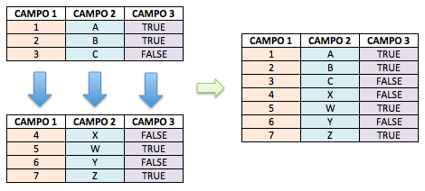
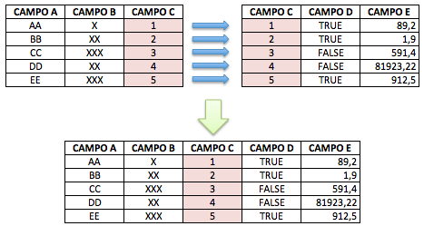
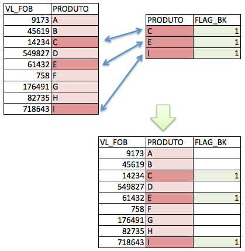
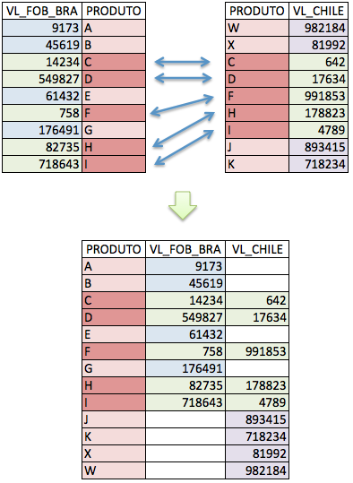

# Juntando dados

```{r echo=FALSE, message=FALSE, warning=FALSE}
library(dplyr)
library(readr)
```

Existem duas grandes formas de junção de dados: **UNIÃO** e **CRUZAMENTO**.

Para que uma união seja possível, os dois conjuntos de dados precisam ter os mesmos campos. Para que um cruzamento seja possível, os dois conjuntos precisam ter pelo menos um campo em comum.

```{r echo=FALSE, fig.cap='União de tabelas'}

```

```{r echo=FALSE, fig.cap='Cruzamento de tabelas'}

```

## União de dados (Union)

A união de dados é mais intuitiva. Basta ter a mesma quantidade de campos e que estes estejam "alinhados". A função mais usada para isso é o famoso `rbind()` (Row Bind). Caso os campos tenham exatamente os mesmos nomes e tipo, o `rbind()` consegue fazer a união perfeitamente.

```{r}
dados2016 <- data.frame(ano = c(2016, 2016, 2016), 
                        valor = c(938, 113, 1748), 
                        produto = c('A', 'B', 'C'))

dados2017 <- data.frame(valor = c(8400, 837, 10983), 
                        produto = c('H', 'Z', 'X'),
                        ano = c(2017, 2017, 2017))

dados.finais <- rbind(dados2016, dados2017)

dados.finais
```

A união de dados é a forma mais simples de juntá-los.

## Cruzamento de Dados (Join)

O cruzamento de dados é um pouco mais complexo, mas nem por isso chega a ser algo difícil.

Para entender-se como fazer "joins" (cruzamentos), é preciso compreender-se o conceito de **chave**. Entenda chave como uma coluna que está presente da mesma forma em dois conjuntos de dados distintos. O conceito completo de chave é bem mais complexo que isto, mas, para começarmos a entender e usar os joins, basta usar essa intuição.

Tendo esse conceito simplificado de chave em mente, a primeira coisa que se deve fazer quando for preciso cruzar dois conjuntos de dados é tentar identificar quais os campos chaves, ou seja, quais campos estão presentes nos dois grupos.

O que acontece quando nem todos os códigos de um grupo estão no outro? E quando um grupo tem códigos repetidos em várias linhas? Para responder a essas e outras perguntas precisamos conhecer os diferentes tipos de joins. Existe pelo menos uma dezena de tipos de joins, mas 90% das vezes você precisará apenas dos tipos básicos que explicaremos a seguir. Usaremos o pacote `dplyr` para aplicar os joins. O R base possui a função `merge()` para joins, se tiver curiosidade procure mais sobre ela depois.

### Inner Join (ou apenas Join)

Trata-se do join mais simples, mais básico e mais usado dentre todos os outros tipos. O seu comportamento mantém no resultado apenas as linhas presentes nos dois conjuntos de dados que estão sendo cruzados. O inner join funciona da seguinte forma:

```{r echo=FALSE, fig.cap='Cruzamento de tabelas'}
knitr::include_graphics("imagens/inner_join.png")
```

A tabela final, após o cruzamento, conterá as linhas com as chaves que estiverem em AMBOS os conjuntos de dados. As linhas com chaves que não estão em ambos serão descartadas. Esta característica torna o inner join muito útil para fazer-se filtros.

Vamos utilizar dados já disponíveis no `dplyr` para testar os joins:

```{r message=FALSE, warning=FALSE}
band_members
band_instruments

str(band_members)
str(band_instruments)
#vamos juntar os dois conjuntos com um join

band_members %>% inner_join(band_instruments) 
#o dplyr "adivinhou" a coluna chave pelo nome
```
Repare que, nesse caso, a chave é a coluna `name`. Repare também que os dois conjuntos têm três registros. Então, por que o resultado final só tem dois registros? A resposta é simples: porque o comportamento do join é justamente retornar apenas as linhas em que as chaves coincidiram (efeito de filtro).

Vamos fazer o mesmo experimento com `band_intruments2`:

```{r}
band_instruments2
str(band_instruments2) #o nome da coluna é diferente

band_members %>% inner_join(band_instruments2, by = c('name' = 'artist'))
```

Repare que, dessa vez, tivemos que especificar qual a coluna chave para que o join aconteça.

Mais um exemplo:

```{r}
setwd('dados')
```

```{r message=FALSE, warning=FALSE}
empregados <- read_csv('dados/Employees.csv')
departamentos <- read_csv('dados/Departments.csv')

str(empregados)
str(departamentos)

empregados
departamentos

final <- empregados %>% 
  inner_join(departamentos, by = c('Employee' = 'Manager'))

final
```

Novamente tivemos o mesmo efeito, listamos apenas os empregados que são gerentes de departamento.

Acontece que existem situações em que esse descarte de registro do inner join não é interessante. Nesses casos usamos outros tipos de join: os Outer Joins. Existem três tipos básicos de outer join: left outer join (ou só left join), right outer join (ou só right join) e full outer join (ou apenas full join).

### Left Outer Join

Chama-se **LEFT** outer join pois todos os registros do “conjunto à esquerda” estarão presentes no resultado final, além dos registros à direita que coincidirem na chave. Podemos usar no caso a seguir:

```{r}
band_members %>% left_join(band_instruments2, by = c('name' = 'artist'))

band_instruments2
```

Reparem no efeito: mesmo Mick não tendo referência no conjunto de dados "à direita" (band_instruments2), ele apareceu no registro final com `NA`, no campo que diz respeito ao conjunto à direita. Da mesma forma, Keith não está presente no conjunto final, pois não tem referência no conjunto à esquerda.

```{r echo=FALSE, fig.cap='Cruzamento de tabelas'}

```

Repare que a "posição" das tabelas faz diferença. No caso da nossa manipulação de exmeplo, aplicamos o left join pois a tabela que queríamos preservar estava "à esquerda" na manipulação.

```{r}
final2 <- empregados %>% 
  left_join(departamentos, by = c('Employee' = 'Manager'))

final2
```

### Right Outer Join

O princípio é EXATAMENTE o mesmo do left join. A única diferença é a permanência dos registros do conjunto à direita. Podemos chegar ao mesmo resultado anterior apenas mudando os data frames de posição na manipulação.

```{r}
final3 <- departamentos %>% 
  right_join(empregados, by = c('Manager'='Employee'))

final3
final2
```

A escolha entre right join e left join depende completamente da ordem em que você escolher realizar as operações. Via de regra, um pode ser substituído pelo outro, desde que a posição dos data frames se ajuste na sequência das manipulações.

### Full Outer Join

Existem, ainda, as situações em que é necessário preservar todos os registros de ambos os conjuntos de dados. O full join tem essa característica. Nenhum dos conjuntos de dados perderá registros no resultado final, isto é, quando as chaves forem iguais, todos os campos estarão preenchidos. Quando não houver ocorrência das chaves em ambos os lados, será informado `NA` em qualquer um deles.

```{r warning=FALSE, message=FALSE}
band_members %>% full_join(band_instruments2, by = c('name' = 'artist'))
```
Reparem que, dessa vez, não perdemos nenhum registro, de nenhum conjunto de dados, apenas teremos `NA` quando a ocorrência da chave não acontecer em alguns dos conjuntos.

O full join funciona da seguinte forma:

```{r echo=FALSE, fig.cap='Cruzamento de tabelas'}

```

```{r}
final4 <- departamentos %>% 
  full_join(empregados, by = c('Manager'='Employee'))

final4
```

Do resultado desse full join, por exemplo, podemos concluir que não tem nenhum _Manager_ no departamento _Resarch_, da mesma forma, os empregados Bob, Carla e Ferdinand não são _managers_ de departamento nenhum.

## Exercícios

```{r echo=FALSE, eval=TRUE}
library(nycflights13)
```

1. Utilizando as bases de dados do pacote `nycflights13`, encontre a tabela abaixo que mostra quais aeroportos (origem e destino) tiveram mais voos. Será necessário utilizar o dataframe `flights` e `airports`. `Dica: primeiro descubra as chaves.`

```{r echo=FALSE}
flights %>% 
  select(origin, dest) %>% 
  inner_join(airports, by = c('origin' = 'faa')) %>% 
  inner_join(airports, by = c('dest' = 'faa')) %>% 
  select(Origem = name.x, Destino = name.y) %>% 
  group_by(Origem, Destino) %>% 
  summarise(qtd = n()) %>% 
  arrange(-qtd)
  
```

2. Utilizando os dataframes abaixo, chegue no resultado a seguir:

```{r}
participantes <- data.frame(
  Nome = c('Carlos', 'Maurício', 'Ana Maria', 'Rebeca', 'Patrícia'),
  Estado = c('Brasília', 'Minas Gerais', 'Goiás', 'São Paulo', 'Ceará'),
  Idade = c(23, 24, 22, 29, 28)
)

aprovados <- data.frame(
  Nome = c('Carlos', 'Patrícia'),
  Pontuacao = c(61, 62)
)

eliminados <- data.frame(
  Nome = c('Maurício', 'Ana Maria', 'Rebeca'),
  Pontuacao = c(49, 48, 48)
)

participantes
aprovados
eliminados
```

```{r echo=FALSE, eval=TRUE}

participantes %>% 
  left_join(aprovados, by = c('Nome' = 'Nome')) %>% 
  left_join(eliminados, by = c('Nome'  = 'Nome')) %>% 
  mutate(Resultado = ifelse(is.na(Pontuacao.x), 'Eliminado', 'Aprovado'),
         Pontuacao = ifelse(is.na(Pontuacao.x), Pontuacao.y, Pontuacao.x)) %>% 
  select(Nome, Estado, Idade, Pontuacao, Resultado)
 
```
