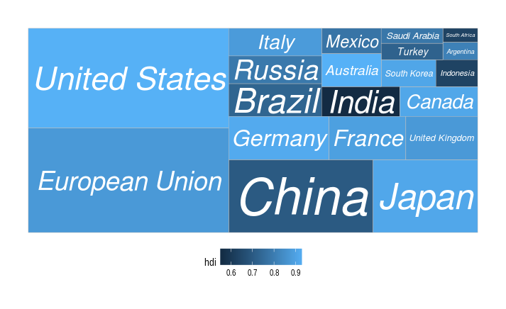
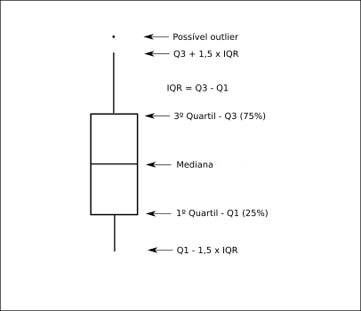
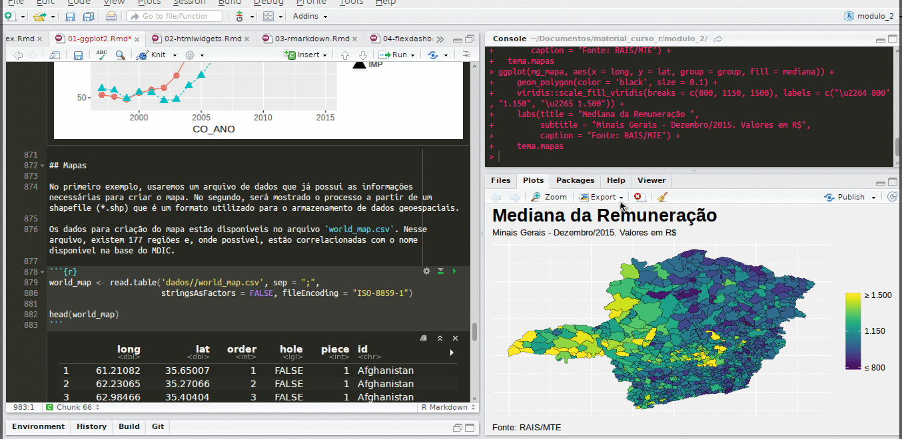

---
output:
  pdf_document: default
  html_document: default
---

# Visualizações de dados (ggplot2) {#ggplot2}

```{r, include=FALSE, warning=FALSE, message=FALSE}
knitr::opts_chunk$set(fig.align='center', fig.width = 7, fig.asp = 0.618,
                      out.width = '100%')
```

O `ggplot2` é mais um pacote desenvolvido por Hadley Wickham, o criador, por exemplo, do `tidyr` e do `dplyr`. A ideia do pacote, ainda que com algumas modificações, vem de uma obra chamada [_The Grammar of Graphics_](https://www.amazon.com/Grammar-Graphics-Statistics-Computing/dp/0387245448), que é uma maneira de descrever um gráfico a partir dos seus componentes. Dessa forma, teoricamente, ficaria mais fácil entender a construção de gráficos mais complexos.

Esse pacote é estruturado de forma que a "gramática" seja utilizada para um gráfico a partir de múltiplas camadas. As camadas serão formadas por dados, mapeamentos estéticos, transformações estatísticas dos dados, objetos geométricos (pontos, linhas, barras etc.) e ajuste de posicionamento. Além disso, existem outros componentes, como os sistemas de coordenadas (cartesiano, polar, mapa etc.) e, se for o caso, divisões do gráfico em subplots (_facet_). Um simples exemplo de múltiplas camadas seria um gráfico de pontos adicionado de uma curva de ajustamento.

Uma forma geral (template) para entender-se a estrutura do ggplot2, segundo o próprio Hadley Wickhan, no livro [R for Data Science](http://r4ds.had.co.nz/data-visualisation.html#the-layered-grammar-of-graphics), é a seguinte:

```
ggplot(data = <DATA>) + 
  <GEOM_FUNCTION>(
     mapping = aes(<MAPPINGS>),
     stat = <STAT>, 
     position = <POSITION>
  ) +
  <COORDINATE_FUNCTION> +
  <FACET_FUNCTION> # dividir o gráfico em subplots
```

A ideia é que todo gráfico pode ser representado por essa forma. No entanto, na criação de um gráfico, não é necessário especificar-se todas as partes acima. O ggplot2 já oferece um padrão para o sistema de coordenadas, para o `stat` e `position`. O `facet` (subplot) só será utilizado quando necessário.

Além disso, existem as escalas que são utilizadas para controlar o mapeamento dos dados em relação aos atributos estéticos do gráfico. Por exemplo: suponha que no seu gráfico exista uma coluna que é uma variável categórica com três classes possíveis e as cores do objeto geométrico estejam associadas a essa variável. Automaticamente, o ggplot2 definirá uma cor pra cada classe. No entanto, você pode alterar a escala de cores para ter controle sobre elas. O mesmo vale para os valores apresentados nos eixos x e y.

Uma observação importante é que apesar dos dados estarem na função `ggplot()` (`<DATA>`), eles também podem ser incluídos diretamente em cada objeto geométrico. Isto será útil quando for necessário criar-se uma nova camada a partir de dados diferentes daqueles que estão inicialmente nos gráficos.

Dessa forma, incorporando essas observações, um template estendido seria o abaixo:

```
ggplot(data = <DATA>) + 
  <GEOM_FUNCTION>(
     mapping = aes(<MAPPINGS>),
     stat = <STAT>, 
     position = <POSITION>,
     data = <DATA> # pode receber os dados diretamente
  ) +
  <SCALE_FUNCTION> + # uma para cada elemento estético
  <COORDINATE_FUNCTION> +
  <FACET_FUNCTION> # dividir o gráfico em subplots
```

Também é importante ressaltar-se que, como todo sistema de gráficos, é possível alterar-se todos os títulos e rótulos do gráfico, além do controle sobre as características do tema do gráfico (cor do fundo, estilo da fonte, tamanho da fonte etc).

Para quebrar-se a barreira inicial, vamos criar um exemplo por partes:

```{r, fig.align='center'}
library(ggplot2)
data("mtcars")

# Inicia o plot
g <- ggplot(mtcars)

# Adicionar pontos (geom_point) e
# vamos mapear variáveis a elementos estéticos dos pontos
# Size = 3 define o tamanho de todos os pontos
g <- g +
  geom_point(aes(x = hp, y = mpg, color = factor(am)),
             size = 3)

# Altera a escala de cores
g <- g +
  scale_color_manual("Automatic",
                     values = c("red", "blue"),
                     labels = c("No", "Yes"))

# Rótulos (títulos)
g <- g +
  labs(title = 'Relação entre consumo, potência e tipo de câmbio',
       y = 'Consumo',
       x = 'Potência')

g
  
```

Note que o gráfico poderia ser criado com um bloco único de código:

```{r, fig.align='center'}
ggplot(mtcars) +
  geom_point(aes(x = hp, y = mpg, color = factor(am)),
             size = 3) +
  scale_color_manual("Automatic",
                     values = c("red", "blue"),
                     labels = c("No", "Yes")) +
  labs(title = 'Relação entre consumo, potência e tipo de câmbio',
       y = 'Consumo',
       x = 'Potência')
  
```


Detalharemos cada parte do gráfico, mas vale falar-se rapidamente sobre o código acima. Primeiramente, passamos um conjunto de dados para o ggplot. Depois, adicionamos uma camada de pontos, mapeando as variáveis `hp` e `mpg` para as posições de cada ponto nos eixos `x` e `y`, respectivamente, e a variável `am` para a cor de cada ponto. Em seguida, alteramos a escala de cor, definindo seu título, os rótulos (`labels`) e os valores (`values`) para as cores. Por fim, definimos os títulos/rótulos do gráfico.

Nas próximas seções, falaremos com mais detalhes sobre cada componente, começando pelo mapeamento estético.

## Mapeamento Estético

O mapeamento estético é o mapeamento das variáveis dos dados para as características visuais dos objetos geométricos (pontos, barras, linhas etc.). Isto é feito a partir da função `aes()`. E quais são as características visuais de um objeto geométrico? Abaixo segue uma lista não exaustiva:

- Posição (`x` e `y`);
- Cor (`color`);
- Tamanho (`size`);
- Preenchimento (`fill`);
- Transparência (`alpha`);
- Texto (`label`).

Como vimos no exemplo acima, mapeamos três variáveis para três características visuais de cada ponto: posição `x`, posição `y` e cor. Nos próximos exemplos, outros elementos estéticos serão utilizados, conforme o objeto geométrico selecionado.

## Objetos geométricos

Os objetos geométricos começam com a expressão `geom_` e são seguidos pelo tipo de objeto. Por exemplo, `geom_point()` para pontos  e `geom_bar()` para barras. A tabela abaixo apresenta os tipos de objetos geométricos utilizados para criar-se alguns tipos de gráficos populares.

Tipo | Objeto Geométrico
:-----:+:-----------------:
Dispersão (scatterplot) | `geom_point()`
Gráfico de bolhas | `geom_point()`
Gráfico de barras | `geom_bar()` e `geom_col()`
Histograma | `geom_histogram()`
Boxplot | `geom_boxplot()`
Densidade | `geom_density()`
Gráfico de linhas | `geom_line()`

Nesse material, os principais tipos de objetos geométricos serão demonstrados a partir de exemplos. A lista completa de objetos geométricos e as descrições dos argumentos estão na [documentação](http://docs.ggplot2.org/current/) do `ggplot2`.

É importante saber-se que um gráfico do ggplot2 pode ter mais de um objeto geométrico, cada um formando uma camada. Por exemplo, uma camada de pontos e outra de linhas que conectam os pontos.

Vamos, primeiramente, criar um gráfico com pontos a partir dos dados `mtcars`. Use `?mtcars` para mais detalhes.

```{r, fig.align='center', warning=FALSE, message=FALSE}
g1 <- ggplot(mtcars, aes(y = mpg, x = disp)) +
  geom_point()

g1
```
> Note que o `aes()` está sendo usado diretamente na função `ggplot()` e não no objeto geométrico. O que isto significa? Que o mapeamento estético definido na função `ggplot()` é global. Ou seja, é aplicado para todos os objetos geométricos daquele gráfico, a menos que seja explicitado novamente em alguma camada.

Para finalizarmos essa breve introdução a objetos geométricos, adicionemos mais uma camada ao gráfico:

```{r, warning=FALSE, message=FALSE, fig.align='center'}
library(dplyr)
mtcars <- mtcars %>% 
  mutate(name = rownames(mtcars))
ggplot(mtcars, aes(y = mpg, x = disp)) +
  geom_point() +
  geom_smooth()
```
No caso, adicionamos uma curva de ajustamento aos dados, que tem o objetivo de evidenciar um padrão nos mesmos.

## Escalas

O controle sobre as escalas do gráfico é fundamental no ajuste de um gráfico. Em geral, o ggplot2, como outros pacotes gráficos, fornece as escalas automaticamente, não sendo necessário o entendimento de como se controlar este componente. No entanto, se o interesse é ter controle sobre todos os aspectos de um gráfico, esse componente é fundamental.

Veja o gráfico abaixo:

```{r, fig.align='center'}
ggplot(iris, aes(x = Petal.Length, y = Petal.Width, color = Species)) +
  geom_point()
```

Note que a cor está mapeada para a variável `Species`. O `ggplot2`, automaticamente, criou a seguinte escala:

Species           | Cor
:----------------:|:--------------:
setosa            | vermelho
versicolor        | verde
virginica         | azul

Todavia, é comum haver interesse em alterar-se essas cores, ou seja, alterar-se a escala de cor. Como fazer isso no ggplot2? Podemos usar, por exemplo, a função `scale_color_manual()`:

```{r}
ggplot(iris, aes(x = Petal.Length, y = Petal.Width, color = Species)) +
  geom_point() +
  scale_color_manual(values = c("orange", "black", "red"))
```

Utilizamos a função `scale_color_manual()` em razão da variável `Species` ser categórica. Para o ggplot2, dados categóricos são discretos, e a função citada permite criar-se uma escala discreta customizada. No entanto, essa não é a única função para controlar escala de cor. Existem outras como `scale_color_discrete()`, `scale_color_continuous()`, `scale_color_gradient()` etc. A utilização de cada função depende do tipo de dado que se está associando ao elemento estético `color`. Adiante, entraremos em mais detalhes sobre os tipos de dados.

As funções utilizadas para controlar-se as escalas dos elementos de um gráfico do ggplot2 seguem um padrão. Todas iniciam-se com `scale_`, depois o nome do elemento estético (color, fill, x etc.) e, por fim, o tipo/nome da escala que será aplicada.

Abaixo, continuaremos o exemplo anterior, alterando as escalas dos eixos x e y. Note que as variáveis `Petal.Length` e `Petal.Width` são variáveis numéricas/contínuas. Dessa forma, utilizaremos as funções `scale_x_continuous()` e `scale_y_continuous()`: 

```{r}
ggplot(iris, aes(x = Petal.Length, y = Petal.Width, color = Species)) +
  geom_point() +
  scale_color_manual(values = c("orange", "black", "red")) +
  scale_x_continuous(name = "Petal Length", breaks = 1:7) + 
  scale_y_continuous(name = "Petal Width", breaks = 0:3, limits = c(0, 3))
```

No gráfico acima, definimos quais seriam os pontos em que rótulos deveriam ser exibidos em cada eixo. Além disso, no eixo y, definimos que os limites seriam 0 e 3.

### Tipos de Variáveis

Para melhor uso das escalas, é preciso saber o tipo de variável que foi mapeado para cada elemento estético. Vamos rapidamente montar essa relação:

Classe  | Exemplo | Tipo no ggplot2
:-------:|:---------:|:------------------:
numeric | seq(0, 1, length.out = 10) | continuous
integer | 1L:10L | continuous ou discrete
character | c("Sim", "Não") | discrete
factor | factor(c("Sim", "Não")) | discrete
date | seq(as.Date("2000/1/1"), by = "month", length.out = 12) | date

Lembre-se que o padrão do ggplot é `scale_`, depois o nome do elemento estético (color, fill, x etc.) e, por fim, o tipo/nome da escala que será aplicada. É importante que o usuário saiba o tipo de dado, pois assim saberá com mais facilidade qual é o tipo de escala que deve ser escolhido.

Vamos, em sequência, entrar em mais detalhes para escalas dos eixos (`x` e `y`) e de cores. Espera-se que a intuição desenvolvida a partir dos exemplos das escalas para esses elementos estéticos seja útil para os demais elementos estéticos.

### Eixos

#### Variáveis Contínuas

```{r, eval = FALSE}
scale_x_continuous(name = waiver(), breaks = waiver(), minor_breaks = waiver(),
                   labels = waiver(), limits = NULL, expand = waiver(),
                   oob = censor, na.value = NA_real_, trans = "identity")

scale_y_continuous(name = waiver(), breaks = waiver(), minor_breaks = waiver(),
                   labels = waiver(), limits = NULL, expand = waiver(),
                   oob = censor, na.value = NA_real_, trans = "identity")
```

Vamos começar editando os valores dos eixos `x` e `y`. Anteriormente, já demos uma pequena amostra sobre a edição dos eixos `x` e `y`. Abaixo, será apresentado mais um exemplo:

```{r}
library(ISLR)

ggplot(Wage, aes(x = age, y = wage, color = education)) +
  geom_point() +
  scale_x_continuous("Idade", breaks = seq(0, 80, 5),
                     expand = c(0, 5)) +
  scale_y_continuous("Salário", labels = function(x) paste0("US$ ", x),
                     limits = c(0, 400))
```

Para o eixo `x`, determinamos que as quebras (`breaks`) acontecem a cada 5 anos. O `expand(0,0)` é um argumento que controla os espaços adicionais no final do gráfico. É preciso fornecer-se um vetor de tamanho 2, com uma constante multiplicativa e outra aditiva. No exemplo acima, eliminamos a expansão.

Para o eixo `y`, informamos que o nome do eixo é `Salário`, que os limites inferior e superior são 0 e 400 e alteramos os rótulos. No caso, passamos uma função que concatena `US$` com o valor que já seria exibido. Note que, sabendo de antemão todos os breaks, é possível definir-se manualmente os labels. Veremos isso no exemplo com variáveis categóricas, no entanto, para variáveis contínuas, o uso de funções parece mais apropriado.

#### Variáveis discretas

Apesar do _help_ não apresentar todos os argumentos para as escalas discretas, podemos usar quase todos que foram listados para escala contínua.

```{r, eval = FALSE}
scale_x_discrete(..., expand = waiver(), position = "bottom")

scale_y_discrete(..., expand = waiver(), position = "left")
```

No exemplo abaixo, alteraremos os rótulos para uma escala discreta, que originalmente contém os valores `Yes` e `No`.

```{r}
ggplot(Default, aes(x = default, y = balance)) +
  geom_boxplot() + 
  scale_x_discrete("Calote", labels = c("Não", "Sim")) +
  labs(y = "Valor devido médio após o pagamento mensal")
```

Pode-se utilizar o argumento `limits` para alterar-se a ordem das categorias.

```{r}
ggplot(Default, aes(x = default, y = balance)) +
  geom_boxplot() + 
  scale_x_discrete("Calote", limits = c("Yes", "No"),
                   labels = c("Sim", "Não")) +
  labs(y = "Valor devido médio após o pagamento mensal")
```

Também pode-se alterar a ordem de variáveis categóricas alterando-se a ordem dos níveis (`levels`) da variável no data.frame original, ou utilizando-se as funções `ylim()` e `xlim()`. Experimente.

```{r, include = FALSE}
Default <- Default %>% 
  mutate(default = factor(default, c("Yes", "No")))

ggplot(Default, aes(x = default, y = balance)) +
  geom_boxplot() + 
  scale_x_discrete("Calote", labels = c("Sim", "Não")) +
  labs(y = "Valor devido médio após o pagamento mensal")
```
#### Variáveis de Datas

Quando estamos trabalhando com séries temporais, é comum que datas sejam associadas a algum eixo do gŕafico, geralmente ao eixo `x`. As funções padrão para controle de escalas dos eixos, para variáveis de datas, são as seguintes:

```{r, eval=FALSE}
scale_x_date(name = waiver(), breaks = waiver(), date_breaks = waiver(),
             labels = waiver(), date_labels = waiver(), minor_breaks = waiver(),
             date_minor_breaks = waiver(), limits = NULL, expand = waiver())

scale_y_date(name = waiver(), breaks = waiver(), date_breaks = waiver(),
             labels = waiver(), date_labels = waiver(), minor_breaks = waiver(),
             date_minor_breaks = waiver(), limits = NULL, expand = waiver())

scale_x_datetime(name = waiver(), breaks = waiver(), date_breaks = waiver(),
                 labels = waiver(), date_labels = waiver(), minor_breaks = waiver(),
                 date_minor_breaks = waiver(), limits = NULL, expand = waiver())

scale_y_datetime(name = waiver(), breaks = waiver(), date_breaks = waiver(),
                 labels = waiver(), date_labels = waiver(), minor_breaks = waiver(),
                 date_minor_breaks = waiver(), limits = NULL, expand = waiver())
```

O `scale_*_date` é utilizado para variáveis do tipo `Date` e `scale_*_datetime` para variáveis do tipo `POSIXct`. A classe `POSIXct` aceita informações relacionadas a tempo/horário e a classe `Date` aceita apenas dia, mês e ano.

O mais importante é a possibilidade de alterar-se o modo como as datas são apresentadas a partir do argumento `date_labels`. Para isso, utilizaremos um exemplo a partir dos dados `economics`. Primeiro, observa-se o resultado padrão do ggplot2:

```{r}
ggplot(economics, aes(x = date, y = unemploy)) +
  geom_line() 
```

Agora, suponha que queremos alterar o gráfico para o formato "Jan/1970":

```{r}
ggplot(economics, aes(x = date, y = unemploy)) +
  geom_line() +
  scale_x_date(date_labels = "%b/%Y")
```

O `%b/%Y` é usado para definir-se o formato de data desejado. Para ver a lista de formatos, use `help(strptime)`. Para os `breaks`, temos duas opções: utilizar-se o argumento `breaks`, informando um vetor de datas, ou usar-se o argumento `date_breaks`, em que se informa a frequência dos breaks (por exemplo, "1 month" e "5 years"). Veja os exemplos abaixos:

```{r}
ggplot(economics, aes(x = date, y = unemploy)) +
  geom_line() +
  scale_x_date(date_breaks = "5 years", date_labels = "%Y")
```

```{r}
seq_datas <- seq.Date(as.Date('1970-01-01'),
                      as.Date('2015-04-01'),
                      by = '5 years')
ggplot(economics, aes(x = date, y = unemploy)) +
  geom_line() +
  scale_x_date(breaks = seq_datas, date_labels = "%Y")
```

### Escalas de Cores (color) e Preenchimento (fill)

Como nos casos dos eixos `x` e `y`, o tipo da variável utilizada define qual o tipo de escala. 

|Tipo da Variável | Escala | Descrição |
------------+----------+----------------------------------------------------------------------
|Discreta  | **hue**       | escolhe n cores igualmente espaçadas em um disco de cores. É possível editar a luminosidade e a saturação. |
|          | grey          | escala de cinza |
|          | brewer        | ver pacote RColorBrewer |
|          | identity      | usa as cores inseridas na própria variável |
|          | manual        | escolhe as cores manualmente |
| Contínua | **gradient**  | cria um gradiente de duas cores (low-high) |
|          | gradient2     | cria um gradiente de cores divergentes (low-mid-high) |
|          | gradientn     | cria um gradiente com n cores

A opção `hue` usa a seguinte roda de cores:

```{r, echo=FALSE, fig.cap='Roda de Cores - hue'}
library(ggplot2)
r  <- seq(0,1,length=201)
th <- seq(0,2*pi, length=201)
d  <- expand.grid(r=r,th=th)
gg <- with(d,data.frame(d,x=r*sin(th),y=r*cos(th),
                        z=hcl(h=360*th/(2*pi),c=100*r, l=65)))
ggplot(gg) +
  geom_point(aes(x,y, color=z), size=3)+
  scale_color_identity()+labs(x="",y="") +
  coord_fixed()
```

A opção brewer pode usar as paletas de cores disponíveis no pacote RColorBrewer.

```{r, echo=FALSE}
library(RColorBrewer)
```


```{r, eval = FALSE}
library(RColorBrewer)
display.brewer.all(n=NULL, type="all", select=NULL, exact.n=TRUE,
                                 colorblindFriendly=FALSE)
```

```{r, echo=FALSE}
knitr::include_graphics('images/brewer_pal.png')
```

No exemplo abaixo, vamos utilizar a função `brewer.pal`, que retorna um vetor de cores de alguma paleta do pacote RColorBrewer. O objeto `paleta.gradientn` recebe nove cores da paleta `Reds`. Essas cores são utilizadas na função `scale_fill_gradientn()`.

```{r}
paleta.gradientn <- brewer.pal(n = 9, name = 'Reds')
Credit %>% 
  group_by(Cards, Student) %>%
  summarise(Balance = mean(Balance), n = n()) %>% 
  ggplot(aes(x = Cards, y = Student, fill = Balance)) +
  geom_tile() +
  scale_fill_gradientn(colors = rev(paleta.gradientn)) +
  scale_x_continuous(breaks = 1:9)
```


Alguns pacotes também fornecem escalas de cores próprias, como é o caso do pacote `viridis`.

```{r}
Credit %>% 
  group_by(Cards, Student) %>%
  summarise(Balance = mean(Balance), n = n()) %>% 
  ggplot(aes(x = Cards, y = Student, fill = Balance)) +
  geom_tile() +
  viridis::scale_fill_viridis() +
  scale_x_continuous(breaks = 1:9)
```

Agora, vamos a um exemplo utilizando o `scale_color_manual()`:

```{r}
ggplot(Wage, aes(y = wage, x = age, color = education)) +
  geom_point() +
  scale_color_manual(values = c("#66C2A5", "#FC8D62", "#8DA0CB", "#E78AC3", "#A6D854"))
```

Aqui fizemos uma introdução ao componente de escalas. Não tratamos de todas as funções de escalas. A ideia é passar-se a lógica geral para se utilizar escalas e não que o usuário decore todas as funções, o que seria contraproducente.

## Subplots (facet)

O ggplot2 facilita a criação de subplots nos casos em que se deseja replicar o mesmo gráfico para um conjunto de valores de outra variável. Por exemplo, criar um gráfico da série temporal de desemprego para cada unidade da federação. As duas principais funções são `facet_wrap()` e `facet_grid()`.

* Painéis em formato de grid:
```{r, eval=FALSE}
facet_grid(facets, margins = FALSE, scales = "fixed", space = "fixed", shrink = TRUE,
           labeller = "label_value", as.table = TRUE, switch = NULL, drop = TRUE)
```

* Converte painéis de uma dimensão para duas dimensões:

```{r, eval=FALSE}
facet_wrap(facets, nrow = NULL, ncol = NULL, scales = "fixed", shrink = TRUE,
           labeller = "label_value", as.table = TRUE, switch = NULL, drop = TRUE,
           dir = "h")
```

Antes de mais nada, vamos criar um exemplo para o `facet_wrap()`:

```{r}
ggplot(diamonds, aes(x = carat, y = price)) +
  geom_point()
```
E se o objetivo for comparar essas relações para diferentes grupos de lapidação?
 
```{r}
ggplot(diamonds, aes(x = carat, y = price)) +
  geom_point() +
  facet_wrap(~ cut)
```

Usamos a fórmula `~ cut`. Ou seja, indicamos que queremos quebrar os gráficos pela variável `cut`.

O ggplot2 determinou automaticamente o número de colunas e linhas e fixou as escalas dos eixos. No entanto, podemos definir o número de linhas ou colunas a partir dos argumentos `nrow` e `ncol`. Também é possível definir-se que cada gráfico tenha sua escala. No exemplo abaixo, deixaremos a escala do eixo y livre.

```{r}
ggplot(diamonds, aes(x = carat, y = price)) +
  geom_point() +
  facet_wrap(~ cut, scales = "free_y")
```

Já o uso do `facet_grid()` é indicado para o cruzamento de variáveis. No exemplo abaixo, a relação entre as variáveis `price` e `carat` será "quebrada" para grupos formados pelas variáveis `cut` e `clarity`:

```{r}
ggplot(diamonds, aes(x = carat, y = price)) +
  geom_point() +
  facet_grid(clarity ~ cut)
```

Note que para cada categoria existe um rótulo. Para alterar-se esse relatório, pode-se alterar diretamente o data.frame ou usar a função `labeller()`.

```{r}
nomes_cut <- c(
  Fair = "FAIR",
  Good = "GOOD",
  `Very Good` = "VERY GOOD",
  Premium = "PREMIUM",
  Ideal = "IDEAL"
)

ggplot(diamonds, aes(x = carat, y = price)) +
  geom_point() +
  facet_wrap(~ cut, scales = "free_y",
             labeller = labeller(cut = nomes_cut))
```

## Temas

O ggplot2 fornece alguns temas prontos. Todavia, o usuário pode alterar manualmente cada detalhe de um gráfico ou criar um tema que será utilizado em outras visualizações. Para editar o tema, será usada a função `theme()`. Nesta função, poderão ser alterados os elementos do tema, como a cor de fundo do painel, o tamanho da fonte do eixo x, a posição da legenda etc. A lista de elementos está disponível [neste link](http://docs.ggplot2.org/current/theme.html).

Para cada elemento do tema, um tipo de objeto é esperado para realizar alterações. Por exemplo, para alterar-se o estilo do título do eixo x (`axis.title.x`) é preciso passar-se a função `element_text()`, que possui diversos parâmetros (família da fonte, tipo da fonte, cor, tamanho, alinhamento etc.). Além do `element_text()`, as principais funções para alterar-se elementos do tema são `element_line()`, `element_rect()` e `element_blank()`. O `element_blank()` é usado a fim de que nada seja desenhado para o elemento que recebe esta função.

Em um primeiro momento, pode parecer complicado alterar o tema via código, porém, conforme o usuário for praticando, essas alterações ficarão mais intuitivas. De toda forma, existe um addin para o RStudio que ajuda a customizar-se um gráfico do ggplot2 a partir de uma interface de _point and click_. Para instalá-lo, faça o seguinte:

```{r, eval=FALSE}
install.packages('ggThemeAssist')
```

Para exemplificar a alteração do tema manualmente:

```{r}
ggplot(diamonds, aes(x = carat, y = price)) +
  geom_point() + 
  labs(title = "Carat vs Price") +
  theme(text = element_text(face = "bold"), 
        panel.grid.major = element_line(colour = "gray80"), 
        axis.title = element_text(size = 14),
        panel.background = element_rect(fill = "gray100"))
```

### Temas disponíveis no ggplot2

```{r, fig.height=20, eval=FALSE}
p <- ggplot(diamonds, aes(x = carat, y = price)) +
  geom_point() 
p + theme_gray() +
  labs(title = "theme_gray()")

p + theme_bw() +
  labs(title = "theme_bw()")

p + theme_linedraw() +
  labs(title = "theme_linedraw()")

p + theme_light() +
  labs(title = "theme_light()")

p + theme_minimal() +
  labs(title = "theme_minimal()")

p + theme_classic() +
  labs(title = "theme_classic()")

p + theme_dark() +
  labs(title = "theme_dark()")

p + theme_void() +
  labs(title = "theme_void()")
```

```{r, fig.height=30, echo=FALSE, fig.asp = 3}
p <- ggplot(diamonds, aes(x = carat, y = price)) +
  geom_point() 

p1 <- p + theme_gray() +
  labs(title = "theme_gray()")

p2 <- p + theme_bw() +
  labs(title = "theme_bw()")

p3 <- p + theme_linedraw() +
  labs(title = "theme_linedraw()")

p4 <- p + theme_light() +
  labs(title = "theme_light()")

p5 <- p + theme_minimal() +
  labs(title = "theme_minimal()")

p6 <- p + theme_classic() +
  labs(title = "theme_classic()")

p7 <- p + theme_dark() +
  labs(title = "theme_dark()")

p8 <- p + theme_void() +
  theme(text = element_text(angle = 0)) +
  labs(title = "theme_void()")

gridExtra::grid.arrange(p1, p2, p3, p4, p5, p6, p7, p8, ncol = 1)
```

### Temas no pacote ggthemes

O pacote [`ggthemes`](https://github.com/jrnold/ggthemes) disponibiliza um conjunto de temas e escalas de cores. Vamos apresentar alguns temas disponíveis:

```{r, fig.height=30, echo=FALSE, fig.asp = 3}
library(ggthemes)
p1 <- p + theme_base() +
  labs(title = "theme_base()")

p2 <- p + theme_economist() +
  labs(title = "theme_economist()")

p3 <- p + theme_few() +
  labs(title = "theme_few()")

p4 <- p + theme_fivethirtyeight() +
  labs(title = "theme_fivethirtyeight()")

p5 <- p + theme_gdocs() +
  labs(title = "theme_gdocs()")

p6 <- p + theme_hc() +
  labs(title = "theme_hc()")

p7 <- p + theme_tufte() +
  labs(title = "theme_tufte()")

p8 <- p + theme_wsj() +
  labs(title = "theme_wsj()")

gridExtra::grid.arrange(p1, p2, p3, p4, p5, p6, p7, p8, ncol = 1)

```

### hrbrthemes

Alguns pacotes fornecem seus próprios temas. É o caso do `hrbrthemes`. Este pacote fornece um tema bastante interessante e será usado no resto deste capítulo. Como qualquer outro tema, se for necessário, você pode editá-lo com a função `theme()`:

```{r, eval=FALSE}
install.packages("hrbrthemes")
```

```{r}
library(hrbrthemes)
ggplot(diamonds, aes(x = carat, y = price)) +
  geom_point() +
  labs(title = "theme_ipsum()") +
  theme_ipsum(plot_title_size = 12,
              axis_title_size = 10)
```

### Setando o tema globalmente

Com o comando abaixo, todos os gráficos do seu script terão o mesmo tema:

```{r}
theme_set(theme_ipsum(plot_title_size = 12,
              axis_title_size = 10) +
          theme(text = element_text(angle = 0)))
```


## Legendas

Parte das alterações das legendas pode ser feita via `theme()`. Essas alterações são gerais para todas as legendas. Se o interesse for em mudanças pontuais na legenda de algum elemento estético, serão utilizadas as funções `guides()`, `guide_legend()` e `guide_colorbar()`.

```{r, eval=FALSE}
guide_legend(title = waiver(), title.position = NULL, title.theme = NULL,
             title.hjust = NULL, title.vjust = NULL, label = TRUE,
             label.position = NULL, label.theme = NULL, label.hjust = NULL,
             label.vjust = NULL, keywidth = NULL, keyheight = NULL,
             direction = NULL, default.unit = "line", override.aes = list(),
             nrow = NULL, ncol = NULL, byrow = FALSE, reverse = FALSE, order = 0, ...)

guide_colourbar(title = waiver(), title.position = NULL, title.theme = NULL,
                title.hjust = NULL, title.vjust = NULL, label = TRUE,
                label.position = NULL, label.theme = NULL, label.hjust = NULL,
                label.vjust = NULL, barwidth = NULL, barheight = NULL, nbin = 20,
                raster = TRUE, ticks = TRUE, draw.ulim = TRUE, draw.llim = TRUE,
                direction = NULL, default.unit = "line", reverse = FALSE, order = 0, ...)
```

O código abaixo exemplifica o uso do `guide_legend()`: 

```{r}
ggplot(diamonds, aes(x = carat, y = price, color = cut, shape = cut)) +
  geom_point() +
  guides(color = guide_legend(title = "Cor", title.position = "left", keywidth = 5),
         shape = guide_legend(title = "Forma", title.position = "right", override.aes = aes(size = 5)))
```

Pode-se fazer uso do "none" para omitir-se a legenda de um elemento estético:

```{r}
ggplot(diamonds, aes(x = carat, y = price, color = cut, shape = cut)) +
  geom_point() +
  guides(color = guide_legend(title = "Cor", title.position = "left", keywidth = 5),
         shape = "none")
```

## Escolhendo o tipo de gráfico

Antes de decidir qual gráfico você utilizará, é preciso saber o que se deseja representar. O objetivo guiará o tipo de gráfico mais adequado. A imagem abaixo apresenta uma lista bastante completa de possibilidades de gráficos, dos mais simples aos mais complexos:


Entre [neste link](https://camo.githubusercontent.com/ea2e9eda9b01fafc1213f5c400aa357584f40df8/687474703a2f2f626c6f672e76697375616c2e6c792f77702d636f6e74656e742f75706c6f6164732f323031342f30392f696d6167652d362e706e67) para visualizar a imagem com zoom.

Os gráficos mais tradicionais podem ser facilmente criados a partir da lógica de camadas do ggplot2 e dos objetos geométricos disponíveis no pacote. Para gráficos mais complexos, alguns pacotes estão disponíveis. Por exemplo, para a criação de treemaps, existe o pacote `treemapify`.

```{r, eval=FALSE}
library(treemapify)

ggplot(G20, aes(area = gdp_mil_usd, fill = hdi, label = country)) +
  geom_treemap() +
  geom_treemap_text(fontface = "italic", colour = "white", place = "centre",
                    grow = TRUE) +
  theme(legend.position = 'bottom')
```



## Gráfico de Dispersão (`geom_point()`)

```{r, eval = FALSE}
geom_point(mapping = NULL, data = NULL, stat = "identity", position = "identity",
           ..., na.rm = FALSE, show.legend = NA, inherit.aes = TRUE)
```

O gráfico de dispersão é bastante usado para verificar-se relações entre duas variáveis quantitativas. Para exemplificar, utilizaremos a base disponível no pacote `gapminder`. Nesta base, existe uma variável de expectativa de vida e outra de renda per capita.

Como queremos um gráfico de pontos, o objeto geométrico natural é o `geom_point()`. Esse objeto geométrico tem os seguintes elementos estéticos:

Os parâmetros estéticos (aes) são:

* **`x`**
* **`y`**
* `alpha`
* `colour`
* `fill`
* `shape`
* `size`
* `stroke` 

Vamos verificar qual é a relação entre essas duas variáveis:

```{r}
library(hrbrthemes)
library(gapminder)
gapminder %>% 
  filter(year == max(year)) %>% 
  ggplot(aes(x = gdpPercap, y = lifeExp)) +
  geom_point() +
  labs(title = "Relação entre Renda per Capita e Expectativa de Vida - 2007",
       x = "Renda per Capita",
       y = "Expectativa de Vida") +
  theme_ipsum(plot_title_size = 12,
              axis_title_size = 10)
```

Note que a expectativa de vida cresce muito rápido para níveis de renda baixos, mas o incremento decresce conforme o nível de renda aumenta. Esse fato pode ser melhor representado utilizando-se uma escala logarítmica para a variável renda per capita. É assim que, usualmente, essa relação é apresentada. Para isso, poderíamos aplicar a função `log10()` na variável de renda per capita, ou utilizarmos a função `scale_x_log10()`:

```{r}
gapminder %>% 
  filter(year == max(year)) %>% 
  ggplot(aes(x = gdpPercap, y = lifeExp)) +
  geom_point() + 
  scale_x_log10() +
  labs(title = "Relação entre Renda per Capita e Expectativa de Vida - 2007",
       x = "Renda per Capita (escala log 10)",
       y = "Expectativa de Vida") +
  theme_ipsum(plot_title_size = 12,   
              axis_title_size = 10)
```

Com essa escala, valores incrementados na ordem de dez vezes serão igualmente espaçados. Nesse caso, a relação parece ser mais linear, ou seja, ao aumentarmos a renda dez vezes, espera-se que a expectativa de vida cresça a uma taxa constante.

Vamos mapear a variável `continent` ao elemento estético color e shape:

```{r}
gapminder %>% 
  filter(year == max(year)) %>% 
  ggplot(aes(x = gdpPercap, y = lifeExp, 
             color = continent, shape = continent)) +
  geom_point() + 
  scale_x_log10() +
  scale_color_discrete("Continente") +
  scale_shape_discrete("Continente") +
  labs(title = "Relação entre Renda per Capita e Expectativa de Vida - 2007",
       x = "Renda per Capita (escala log 10)",
       y = "Expectativa de Vida") +
  theme_ipsum(plot_title_size = 12,   
              axis_title_size = 10)
```

Automaticamente o ggplot2 criou uma escala para as cores e formatos dos pontos. O usuário pode alterar este mapeamento utilizando as funções `scale_*_*`.

Por fim, fica aqui a lista com os tipos de shapes:

```{r, echo = FALSE}
d=data.frame(p=c(0:25,32:127))
ggplot() +
scale_y_continuous(name="") +
scale_x_continuous(name="") +
scale_shape_identity() +
geom_point(data=d, mapping=aes(x=p%%16, y=p%/%16, shape=p), size=5, fill="red") +
geom_text(data=d, mapping=aes(x=p%%16, y=p%/%16+0.25, label=p), size=3, vjust = 0)
```

Perceba que os formatos de 21 a 24 possuem preenchimento (`fill`). Assim, no código abaixo definiremos o preenchimento, o tamanho do ponto e a espessura para aqueles formatos que possuem contornos.

```{r}
gapminder %>% 
  filter(year == max(year)) %>% 
  ggplot(aes(x = gdpPercap, y = lifeExp, 
             color = continent, shape = continent)) +
  geom_point(fill = "black", size = 3, stroke = 1) + 
  scale_x_log10() +
  scale_color_discrete("Continente") +
  scale_shape_manual("Continente", values = c(19, 21, 22, 23, 24)) +
  labs(title = "Relação entre Renda per Capita e Expectativa de Vida - 2007",
       x = "Renda per Capita (escala log 10)",
       y = "Expectativa de Vida")
```

## Gráficos de Bolhas

O gráfico de bolha é uma extensão natural do gráfico de pontos. Ele permite observar-se possíveis relações entre as três variáveis. Para este tipo de gráfico, são necessárias três variáveis: duas para indicarem as posições x e y e uma terceira para definir o tamanho do ponto (`size`). Vamos utilizar a variável `pop` (população):

```{r}
gapminder %>% 
  filter(year == max(year)) %>% 
  ggplot(aes(x = gdpPercap, y = lifeExp, 
             size = pop)) +
  geom_point() + 
  scale_size_continuous("População (milhões)", labels = function(x) round(x/1e6)) +
  scale_x_log10() +
  labs(title = "Relação entre Renda per Capita e Expectativa de Vida - 2007",
       x = "Renda per Capita (escala log 10)",
       y = "Expectativa de Vida") +
  theme_ipsum(plot_title_size = 12,    
              axis_title_size = 10)
```

## Gráficos de Barras

Os gráficos de barras/colunas são geralmente utilizados para comparações entre categorias (variáveis qualitativas). No ggplot2 podemos usar dois objetos geométricos distintos:

```{r, eval = FALSE}
geom_bar(mapping = NULL, data = NULL, stat = "count", position = "stack", ...,
         width = NULL, binwidth = NULL, na.rm = FALSE, show.legend = NA,
         inherit.aes = TRUE)

geom_col(mapping = NULL, data = NULL, position = "stack", ...,
  width = NULL, na.rm = FALSE, show.legend = NA, inherit.aes = TRUE)
```

Os parâmetros estéticos (aes) são:

* **`x`**
* `y` (somente com `stat=identity`)
* `alpha`
* `colour`
* `fill`
* `linetype`
* `size`

Há um detalhe importante para o `geom_bar()`: o argumento `stat`. Por padrão, para este objeto geométrico, o valor de `stat` é `count`, o que significa que ele fará uma contagem dos elementos do eixo x. Essa contagem será usada no eixo `y`. Por exemplo:

```{r}
ggplot(diamonds, aes(x = cut)) +
  geom_bar() +
  theme_ipsum(plot_title_size = 12,   
              axis_title_size = 10)
```

Para cada valor da variável `cut`, o ggplot2 calculou o número de observações no data.frame `diamonds`.

Para que o `y` seja mapeado para uma variável do data.frame, é necessário definir `stat = identity`.

```{r}
gapminder %>% 
  filter(year == max(year),
         continent == "Americas") %>% 
  ggplot(aes(x = country, y = lifeExp)) +
  geom_bar(stat = "identity", fill = "dodgerblue") +
  labs(title = "Expectativa de vida por país",
       subtitle = "2007",
       x = "País",
       y = "Expectativa de Vida") +
  theme(axis.text.x = element_text(angle = 90, hjust = 1))
```

Usando o `geom_col()`:

```{r}
gapminder %>% 
  filter(year == max(year),
         continent == "Americas") %>% 
  ggplot(aes(x = country, y = lifeExp)) +
  geom_col(fill = "dodgerblue") +
  labs(title = "Expectativa de vida por país",
       subtitle = "2007",
       x = "País",
       y = "Anos") +
  theme(axis.text.x = element_text(angle = 90, hjust = 1))
```

Uma pergunta recorrente é: Como ordenar as barras em ordem crescente/decrescente? Para isso, pode-se utilizar a função `reorder()` no momento do mapeamento. Fica mais claro com um exemplo:

```{r}
gapminder %>% 
  filter(year == max(year),
         continent == "Americas") %>% 
  ggplot(aes(x = reorder(country, -lifeExp), y = lifeExp)) +
  geom_col(fill = "dodgerblue") +
  labs(title = "Expectativa de vida por país",
       subtitle = "2007",
       x = "País",
       y = "Anos") +
  theme(axis.text.x = element_text(angle = 90, hjust = 1))
```

Vamos, agora, criar um gráfico em que se compara a expectativa de vida média por continente em 1957 e 2007:

```{r}
gapminder %>% 
  filter(year %in% c(1957, 2007)) %>% 
  # Converte o ano para factor - será categoria no gráfico
  mutate(year = factor(year)) %>% 
  group_by(continent, year) %>% 
  summarise(lifeExp = mean(lifeExp)) %>% 
  ggplot(aes(x = continent, y = lifeExp, fill = year)) +
  geom_col() +
  theme_ipsum(plot_title_size = 12,   
              axis_title_size = 10)
```

Para continente, o gráfico empilhou as barras. Isto se deve ao argumento `position = stack`. Para colocar as barras lado a lado, utilizamos o valor "dodge":

```{r}
gapminder %>% 
  filter(year %in% c(1957, 2007)) %>% 
  # Converte o ano para factor - será categoria no gráfico
  mutate(year = factor(year)) %>% 
  group_by(continent, year) %>% 
  summarise(lifeExp = mean(lifeExp)) %>% 
  ggplot(aes(x = continent, y = lifeExp, fill = year)) +
  geom_col(position = "dodge") +
  labs(title = "Expectativa de vida por continente",
       x = "Continente",
       y = "Anos",
       fill = "Ano") +
  theme_ipsum(plot_title_size = 12, 
              axis_title_size = 10)

```

Também é comum representar-se as barras de forma horizontal. Para isto basta usar a função `coord_flip()`:

```{r}
gapminder %>% 
  filter(year %in% c(1957, 2007)) %>% 
  # Converte o ano para factor - será categoria no gráfico
  mutate(year = factor(year)) %>% 
  group_by(continent, year) %>% 
  summarise(lifeExp = mean(lifeExp)) %>% 
  ggplot(aes(x = continent, y = lifeExp, fill = year)) +
  geom_col(position = "dodge") +
  coord_flip() +
  labs(title = "Expectativa de vida por continente",
       x = "Continente",
       y = "Anos",
       fill = "Ano") +
  theme_ipsum(plot_title_size = 12, 
              axis_title_size = 10)

```

## Gráficos de linhas

Os gráficos de linhas são, geralmente, utilizados para apresentar-se a evolução de uma variável quantitativa em um intervalo de tempo.

```{r, eval=FALSE}
geom_line(mapping = NULL, data = NULL, stat = "identity", position = "identity",
          na.rm = FALSE, show.legend = NA, inherit.aes = TRUE, ...)
```

Os parâmetros estéticos (aes) são:

* **`x`**
* **`y`**
* `alpha`
* `colour`
* `linetype`
* `size`

```{r}
gapminder %>% 
  group_by(continent, year) %>% 
  summarise(lifeExp = mean(lifeExp)) %>% 
  ggplot(aes(x = year, y = lifeExp, color = continent)) +
  geom_line() +
  labs(title = "Evolução da expectativa de vida por continente",
       x = "Ano",
       y = "Anos de vida",
       color = "Continente") +
  theme_ipsum(plot_title_size = 12,   
              axis_title_size = 10)
```

É bastante comum que gráficos de linhas apresentem marcações para os períodos em que realmente existem os dados. Para isso, podemos adicionar uma camada de pontos:

```{r}
gapminder %>% 
  group_by(continent, year) %>% 
  summarise(lifeExp = mean(lifeExp)) %>% 
  ggplot(aes(x = year, y = lifeExp, color = continent)) +
  geom_line() +
  geom_point(aes(shape = continent)) +
  labs(title = "Evolução da expectativa de vida por continente",
       x = "Ano",
       y = "Anos de vida",
       color = "Continente",
       shape = "Continente") +
  theme_ipsum(plot_title_size = 12,    
              axis_title_size = 10)
```

## Histogramas e freqpoly

```{r, eval=FALSE}
geom_freqpoly(mapping = NULL, data = NULL, stat = "bin",
  position = "identity", ..., na.rm = FALSE, show.legend = NA,
  inherit.aes = TRUE)

geom_histogram(mapping = NULL, data = NULL, stat = "bin",
  position = "stack", ..., binwidth = NULL, bins = NULL, na.rm = FALSE,
  show.legend = NA, inherit.aes = TRUE)
```


Os histogramas são utilizados para representar-se a distribuição de dados de uma variável quantitativa em intervalos contínuos. Esses intervalos são chamados de `bins`. Para cada bin, será apresentada a quantidade de valores que estão naquele intervalo. A diferença para o `geom_freqpoly` é que este utiliza linhas para construir polígonos, enquanto o `geom_histogram` utiliza barras.

Conforme a documentação do ggplot2, o `geom_histogram()` utiliza os mesmos elementos estéticos do `geom_bar()`. Já o `geom_freqpoly()` utiliza os mesmo do `geom_line()`.

```{r}
gapminder %>% 
  filter(year == 2007) %>% 
  ggplot(aes(x = lifeExp)) +
  geom_histogram(binwidth = 5, fill = 'dodgerblue', color = 'black') +
  labs(title = "Distribuição da expectativa vida",
       x = "Anos",
       y = "Contagem") +
  theme_ipsum(plot_title_size = 12,   
              axis_title_size = 10)
```


```{r}
gapminder %>% 
  filter(year == 2007) %>% 
  ggplot(aes(x = lifeExp)) +
  geom_freqpoly(binwidth = 5) +
  labs(title = "Distribuição da expectativa vida",
       x = "Anos",
       y = "Contagem") +
  theme_ipsum(plot_title_size = 12,     
              axis_title_size = 10)
```

Transformando em proporção:

```{r}
gapminder %>% 
  filter(year == 2007) %>% 
  ggplot(aes(x = lifeExp)) +
  geom_histogram(aes(y = ..count../sum(..count..)),binwidth = 5, fill = 'dodgerblue', color = 'black') +
  labs(title = "Distribuição da expectativa vida",
       x = "Anos",
       y = "Proporção") +
  scale_y_continuous(labels = scales::percent_format()) +
  theme_ipsum(plot_title_size = 12,
              axis_title_size = 10)
```

O ggplot2, internamente, criou a variável `..count..`. Dessa forma, podemos utilizá-la para criar as proporções.

## Boxplots, jitterplots e violinplots

O boxplot é uma representação comum para apresentar-se a distribuição de uma variável a partir de seus quantis. A imagem abaixo detalha como um boxplot é formado.



O boxplot também pode ser usado para verificar-se a distribuição de variável para um conjunto de valores de uma segunda variável. Por exemplo: qual é a distribuição da expectativa de vida por ano?

```{r}
ggplot(gapminder, aes(x = factor(year), y = lifeExp)) +
  geom_boxplot(fill = "dodgerblue") +
  labs(y = "Anos de vida",
       x = "Ano",
       title = "Distribuição da expectativa de vida por ano") +
  theme_ipsum(plot_title_size = 12,   
              axis_title_size = 10) 
```

Vemos que existe um possível outlier em 1992. Quando falarmos sobre anotações, voltaremos a este gráfico.

Para termos uma visão da distribuição geral dos valores por ano, podemos utilizar o `geom_violin()`. O violinplot baseia-se na densidade de probabilidade de uma variável contínua. Assim, é possível verificar-se em quais intervalos existe uma maior chance de ocorrência. Isto é representado pela parte mais larga do objeto.

```{r}
ggplot(gapminder, aes(x = factor(year), y = lifeExp)) +
  geom_violin(fill = "dodgerblue") +
  labs(y = "Anos de vida",
       x = "Ano",
       title = "Distribuição da expectativa de vida por ano") +
  theme_ipsum(plot_title_size = 12,  
              axis_title_size = 10) 
```

O jitterplot é utilizado para evitar-se o problema do overplotting em um gráfico. Note, no gráfico abaixo, que não sabemos se a marcação de um ponto representa uma única observação ou várias.

```{r}
ggplot(gapminder, aes(x = factor(year), y = lifeExp)) +
  geom_point() +
  labs(y = "Anos de vida",
       x = "Ano",
       title = "Distribuição da expectativa de vida por ano") +
  theme_ipsum(plot_title_size = 12, 
              axis_title_size = 10) 
```

Para observarmos a real distribuição, é necessário adicionar-se um pouco de ruído, a fim de que os pontos se afastem um pouco:

```{r}
ggplot(gapminder, aes(x = factor(year), y = lifeExp)) +
  geom_jitter() +
  labs(y = "Anos de vida",
       x = "Ano",
       title = "Distribuição da expectativa de vida por ano") +
  theme_ipsum(plot_title_size = 12,      
              axis_title_size = 10) 
```

## Anotações

Para criarmos anotações no ggplot2, podemos utilizar a função `annotate()`.

Primeiro, vamos manipular os dados para saber qual é aquele ponto:

```{r}
gapminder %>% 
  filter(year == 1992, lifeExp == min(lifeExp))
```

Com essas informações, podemos adicionar uma anotação ao gráfico:

```{r}
ggplot(gapminder, aes(x = factor(year), y = lifeExp)) +
  geom_boxplot(fill = "dodgerblue") +
  annotate("text", x = "1992", y = 27, label = "Ruanda") +
  labs(y = "Anos de vida",
       x = "Ano",
       title = "Distribuição da expectativa de vida por ano") +
  theme_ipsum(plot_title_size = 12, 
              axis_title_size = 10) 
```

Também podemos adicionar segmentos e retângulos com o `annotate()`. Vamos marcar o período de 1982 a 2002 com um retângulo:

```{r}
ggplot(gapminder, aes(x = factor(year), y = lifeExp)) +
  annotate("text", x = "1992", y = 27, label = "Ruanda") +
  annotate("rect", xmin = "1982", ymin = 20,
           xmax = "2002", ymax = 95, alpha = 0.2) +
  geom_boxplot(fill = "dodgerblue") +
  labs(y = "Anos de vida",
       x = "Ano",
       title = "Distribuição da expectativa de vida por ano") +
  theme_ipsum(plot_title_size = 12,      
              axis_title_size = 10) 
```

## Cleveland Dot Plot

O cleveland dot plot é uma visualização que pode substituir os gráficos de barras. A ideia é que o gráfico fica menos poluído com os pontos, fazendo com que o leitor foque no que é importante. Vamos criar um gráfico para comparar as expectativas de vida no ano de 2007 para os países das Américas:

```{r}
gapminder %>% 
  filter(year == 2007,
         continent == "Americas") %>% 
  ggplot(aes(x = lifeExp, y = reorder(country, lifeExp))) +
   geom_point(size = 3, color = "dodgerblue") + 
  labs(title = "Expectativa de vida por país - 2007",
       y = "País",
       x = "Anos") +
  theme_ipsum(plot_title_size = 12,   
              axis_title_size = 10) +
  theme(panel.grid.major.y = element_line(linetype = "dashed"))
```

Esse tipo de gráfico também pode apresentar mais de um ponto para cada valor da variável categórica (país):

```{r}
gapminder %>% 
  filter(year %in% c(1987, 2007),
         continent == "Americas") %>% 
  ggplot(aes(x = lifeExp, y = country, color = factor(year))) +
  geom_point(aes(color = factor(year))) + 
  labs(title = "Expectativa de vida por país - 1987 e 2007",
       y = "País",
       x = "Anos",
       color = "Ano") +
  theme_ipsum(plot_title_size = 12,   
              axis_title_size = 10) +
  theme(panel.grid.major.y = element_line(linetype = "dashed"))
```

No gráfico acima, vemos dois pontos para cada país, um para representar 1987 e outro para 2007.

Para completarmos o gráfico, precisamos adicionar uma linha conectando esses dois pontos. Esse gráfico é chamado de _connected dot plot_. Um detalhe importante é que queremos criar uma linha por país, assim, usaremos o elemento estético `group` para obter o resultado esperado:

```{r}
gapminder %>% 
  filter(year %in% c(1987, 2007),
         continent == "Americas") %>% 
  ggplot(aes(x = lifeExp, y = country)) +
  geom_line(aes(group = country)) +
  geom_point(aes(color = factor(year))) + 
  labs(title = "Expectativa de vida por país - 1987 e 2007",
       y = "País",
       x = "Anos",
       color = "Ano") +
  theme_ipsum(plot_title_size = 12,   
              axis_title_size = 10) +
  theme(panel.grid.major.y = element_line(linetype = "dashed"))
```

Para finalizar, vamos ordenar o eixo `y` pela expectativa de vida:

```{r}
gapminder %>% 
  filter(year %in% c(1987, 2007),
         continent == "Americas") %>% 
  ggplot(aes(x = lifeExp, y = reorder(country, lifeExp, max))) +
  geom_line(aes(group = country), color = "grey50") +
  geom_point(aes(color = factor(year))) + 
  labs(title = "Expectativa de vida por país - 1987 e 2007",
       y = "País",
       x = "Anos",
       color = "Ano") +
  theme_ipsum(plot_title_size = 12,
              axis_title_size = 10)  +
  theme(panel.grid.major.y = element_line(linetype = "dashed"))
```


## Textos/Rótulos

```{r, eval=FALSE}
geom_label(mapping = NULL, data = NULL, stat = "identity", position = "identity",
           ..., parse = FALSE, nudge_x = 0, nudge_y = 0,
           label.padding = unit(0.25, "lines"), label.r = unit(0.15, "lines"),
           label.size = 0.25, na.rm = FALSE, show.legend = NA, inherit.aes = TRUE)

geom_text(mapping = NULL, data = NULL, stat = "identity", position = "identity",
          ..., parse = FALSE, nudge_x = 0, nudge_y = 0, check_overlap = FALSE,
          na.rm = FALSE, show.legend = NA, inherit.aes = TRUE)
```

Os parâmetros estéticos (`aes`) são:

* **`label`**
* **`x`**
* **`y`**
* `alpha`
* `angle`
* `colour`
* `family`
* `fontface`
* `hjust`
* `lineheight`
* `size`
* `vjust`

Para adicionar textos ou rótulos, utilizamos, respectivamente, o `geom_text()` e o `geom_label()`, que se diferenciam na formatação. Isto ficará mais claro nos exemplos a seguir:

```{r}
gapminder %>% 
  filter(year == 2007,
         continent == "Americas") %>% 
  ggplot(aes(x = lifeExp, y = reorder(country, lifeExp))) +
  geom_segment(x = 0, aes(xend = lifeExp, yend = country),
               color = "grey50") +
  geom_point(size = 3, color = "dodgerblue") + 
  geom_text(aes(label = round(lifeExp))) +
  labs(title = "Expectativa de vida por país - 2007",
       y = "País",
       x = "Anos") +
  theme_ipsum(plot_title_size = 12,   
              axis_title_size = 10)
```

O resultado ficou bem ruim. O texto foi inserido exatamente na posição `(x, y)`. Para alterar a posição, podemos usar os argumentos `hjust`, `vjust`, `nudge_x` e `nudge_y`. O `hjust` e `vjust` podem assumir valor entre 0 (direita/embaixo) e 1(esquerda/em cima) ou "left", "middle", "right", "bottom", "center" e "top", além de "inward" e "outward".

```{r}
gapminder %>% 
  filter(year == 2007,
         continent == "Americas") %>% 
  ggplot(aes(x = lifeExp, y = reorder(country, lifeExp))) +
  geom_point(size = 3, color = "dodgerblue") + 
  geom_text(aes(label = round(lifeExp)), nudge_x = 1) +
  labs(title = "Expectativa de vida por país - 2007",
       y = "País",
       x = "Anos") +
  theme_ipsum(plot_title_size = 12,   
              axis_title_size = 10)  +
  theme(panel.grid.major.y = element_line(linetype = "dashed"))
```
```{r, fig.height=7}
gapminder %>% 
  filter(year == 2007,
         continent == "Americas") %>% 
  ggplot(aes(x = lifeExp, y = reorder(country, lifeExp))) +
  geom_point(size = 3, color = "dodgerblue") + 
  geom_label(aes(label = round(lifeExp)), nudge_x = 1, size = 3) +
  labs(title = "Expectativa de vida por país - 2007",
       y = "País",
       x = "Anos") +
  theme_ipsum(plot_title_size = 12,  
              axis_title_size = 10)  +
  theme(panel.grid.major.y = element_line(linetype = "dashed"))
```

## Plotando funções

```{r}
reta <- function(a, b, x){
  a + b * x
}
data <- data.frame(x = seq(0, 10, by = 0.1))
ggplot(data, aes(x = x)) +
  stat_function(fun = reta, args = list(a = 1, b = 2)) +
  stat_function(fun = reta, args = list(a = 1, b = 3), col = 'red')
```


```{r}
sigmoid <- function(a = 1,z){
  1/(1 + exp(-a * z))
}

data <- data.frame(x = -6:6)
ggplot(data, aes(x = x)) +
  stat_function(fun = sigmoid, args = list(a = 1)) +
  stat_function(fun = sigmoid, args = list(a = 0.5), color = "blue") +
  stat_function(fun = sigmoid, args = list(a = 2), color = "red") 

```

```{r}
logit <- function(a, z){
  log(sigmoid(a, z)/(1 - sigmoid(a, z)))
}

data <- data.frame(x = -6:6)
ggplot(data, aes(x = x)) +
  stat_function(fun = logit, args = list(a = 1), aes(color = "a = 1")) +
  stat_function(fun = logit, args = list(a = 0.5), aes(color = "a = 0.5")) +
  stat_function(fun = logit, args = list(a = 2), aes(color = "a = 2")) 
```


## Mapas

No primeiro exemplo, usaremos um arquivo de dados que já possui as informações necessárias para criarmos o mapa. No segundo, será mostrado o processo a partir de um shapefile (*.shp), que é um formato utilizado para o armazenamento de dados geoespaciais.

Os dados para a criação do mapa estão disponíveis no arquivo `world_map.csv`. Neste arquivo existem 177 regiões e, onde possível, estas estão correlacionadas com o nome disponível na base do MDIC.

```{r}
library(readr)
world_map <- read_delim('dados/world_map.csv', delim = ";",
                        locale = locale(encoding = "ISO-8859-1",
                                        decimal_mark = ","))

head(world_map)
```

As colunas long e lat serão mapeadas para os eixos x e y e será utilizado o objeto geométrico polígono (`geom_polygon()`). A coluna group será utilizada para que seja criado um polígono para cada região, evitando sobreposições das linhas.

Para a criação do gráfico, removeremos a região `Antarctica` e realizaremos um `left_join()` com os dados de exportações por país de destino no ano de 2015, disponível no arquivo `EXP_2015_PAIS.txt`. Também criaremos classes para os valores exportados.

```{r}
# Remover Antarctica
world_map <- world_map %>% 
   filter(id != "Antarctica")

exp.2015 <- read_delim('dados/EXP_2015_PAIS.csv', delim = ";",
                       locale = locale(encoding = "ISO-8859-1"),
                       col_types = 'ccd')

world_map <- left_join(world_map, exp.2015, by = "NO_PAIS_POR") %>%
  mutate(class = cut(VL_FOB, breaks = c(0, 1e6, 10e6, 100e6, 1e9, 10e9, Inf)))

```

```{r}
ggplot(world_map, aes(x = long, y = lat, group = group)) +
  geom_polygon(aes(fill = class), col = 'black', size = 0.1) +
  scale_fill_brewer(palette = "Reds", breaks = levels(world_map$class),
                    labels = c("(0, 1 Mi]", "(1 Mi, 10 Mi]", "(10 Mi, 100 Mi]",
                               "(100 Mi, 1 Bi]", "(1 Bi, 10 Bi]", "> 10 Bi"),
                    na.value = 'grey70') +
  labs(title = "Exportações Brasileiras - 2015",
       subtitle = 'Valor FOB') +
  coord_quickmap() +
  theme(axis.text.x = element_blank(),
        axis.text.y = element_blank(),
        axis.title.x = element_blank(),
        axis.title.y = element_blank())
```

Como dito, o segundo exemplo será realizado a partir de arquivos do tipo shapefile. O Instituto Brasileiro de Geografia e Estatística (IBGE) disponibiliza shapefiles para o Brasil em diferentes níveis, unidades federativas, municípios, mesorregiões e microrregiões. Os arquivos estão disponíveis [neste link](ftp://geoftp.ibge.gov.br/organizacao_do_territorio/malhas_territoriais/malhas_municipais/municipio_2015/).

Para a leitura do shapefile, serão necessários alguns pacotes: `rgdal`, `maptools`, `rgeos` e `broom`. A função `ogrListLayers()` lista as camadas disponíveis em um shapefile. Para ler-se o arquivo para o R, utiliza-se a função: `readOGR()`. Após ler-se o shapefile para o R, é preciso transformá-lo para um formato em que o ggplot2 possa gerar a visualização. A função `tidy()` realiza essa tarefa. Essa função também transforma objetos de outras classes para data.frames.

```{r, message=FALSE}
library(rgdal)
library(maptools)
library(rgeos)
library(broom)

ogrListLayers('dados/mapas/mg_municipios/31MUE250GC_SIR.shp')
mg_mapa <- readOGR('dados/mapas/mg_municipios/31MUE250GC_SIR.shp',
                   layer = '31MUE250GC_SIR')
```

Os arquivos shapefile também fornecem dados sobre as regiões, disponíveis no arquivo. No caso do exemplo acima, são fornecidos o código e o nome do município.

```{r}
mg_mapa_data <- data.frame(mg_mapa)

head(mg_mapa_data)
```

Na criação do data.frame, com uso da função `fortify()`, é preciso informar a variável que identificará a região. No exemplo, `CD_GEOCMU`.

```{r, message=FALSE}
#mg_mapa <- fortify(mg_mapa, region = "CD_GEOCMU")
mg_mapa <- tidy(mg_mapa, region = "CD_GEOCMU")

# Para adicionar os nomes dos municípios
mg_mapa <- left_join(mg_mapa, mg_mapa_data, by = c("id" = "CD_GEOCMU"))

ggplot(mg_mapa, aes(x = long, y = lat, group = group)) +
  geom_polygon(color = 'black', fill = 'white', size = 0.1) +
  coord_quickmap()
```

Com o mapa pronto, faltam os dados que serão plotados.

```{r}
REM_RAIS_MG_2015 <- read_delim('dados/REM_RAIS_MG_2015.csv',
                               delim = ";", 
                               col_types = 'cd',
                               skip = 1,
                               col_names = c("Mun.Trab", "mediana"),
                               locale = locale(encoding = 'ISO-8859-1'))

REM_RAIS_MG_2015 <- REM_RAIS_MG_2015 %>%
  mutate(mediana = ifelse(mediana > 1500, 1500, mediana))
head(REM_RAIS_MG_2015)

mg_mapa <- mg_mapa %>%
  mutate(Mun.Trab = substr(id, 1, 6))

mg_mapa <- left_join(mg_mapa, REM_RAIS_MG_2015, by = "Mun.Trab")
```

Para criarmos a visualização:

```{r}
cores.viridis <- viridis::viridis(n = 20)
ggplot(mg_mapa, aes(x = long, y = lat, group = group, fill = mediana)) +
  geom_polygon(color = 'black', size = 0.1) +
  scale_fill_gradientn(colours = cores.viridis,
                       breaks = c(800, 1150, 1500),
                       labels = c("\u2264 800", "1.150", "\u2265 1.500")) +
  labs(title = "Mediana da Remuneração ",
       subtitle = "Minais Gerais - Dezembro/2015. Valores em R$",
       caption = "Fonte: RAIS/MTE") +
  coord_quickmap() +
  theme(axis.text.x = element_blank(),
        axis.text.y = element_blank(),
        axis.title.x = element_blank(),
        axis.title.y = element_blank())
```

### Simplificando o shapefile

Em algumas vezes o shapefile pode ser bastante grande, tornando a renderização e o arquivo final relativamente "pesados". É possível simplificar o shapefile com a função `gSimplify()`. Veja o exemplo abaixo:

```{r}
library(rgeos)
mg_mapa <- readOGR('dados/mapas/mg_municipios/31MUE250GC_SIR.shp',
                   layer = '31MUE250GC_SIR')
df <- data.frame(mg_mapa)
mg_mapa <- gSimplify(mg_mapa, tol=0.01, topologyPreserve = TRUE)
mg_mapa = SpatialPolygonsDataFrame(mg_mapa, data=df)

mg_mapa <- tidy(mg_mapa, region = "CD_GEOCMU")

# Para adicionar os nomes dos municípios
mg_mapa <- left_join(mg_mapa, mg_mapa_data, by = c("id" = "CD_GEOCMU"))

ggplot(mg_mapa, aes(x = long, y = lat, group = group)) +
  geom_polygon(color = 'black', fill = 'white', size = 0.1) +
  coord_quickmap()
```

### Encoding dos dados do shapefile

É possível que os nomes das regiões apresentem problemas de codificações se o arquivo estiver em `UTF-8` e o usuário estiver usando o Windows. Nesse caso, pode-se usar a função `iconv()` para converter o encoding.

```{r, eval=FALSE}
mg_mapa <- readOGR('dados/mapas/mg_municipios/31MUE250GC_SIR.shp',
                   layer = '31MUE250GC_SIR')
mg_mapa@data$NM_MUNICIP <- iconv(mg_mapa@data$NM_MUNICIP,
                                 from = "UTF-8",
                                 to = "ISO-8859-1")
```


## Salvando Gráficos

Há duas formas de salvar o gráfico gerado pelo ggplot2. A primeira delas é clicando no botão **Export** na aba **Plots**. Lá existirão três opções: exportar para o clipboard, salvar como PDF ou salvar como imagem.

```{r, eval=FALSE}

```

A outra opção é usar a função `ggsave()`:

```{r, eval=FALSE}
ggsave(filename, plot = last_plot(), device = NULL, path = NULL,
  scale = 1, width = NA, height = NA, units = c("in", "cm", "mm"),
  dpi = 300, limitsize = TRUE, ...)
```

O argumento `device` é usado para escolher-se o tipo de arquivo ("eps", "ps", "tex" (pictex), "pdf", "jpeg", "tiff", "png", "bmp", "svg" or "wmf").

## Extensões do ggplot2

Um conjunto de pacotes fornece extensões ao ggplot2. Ou seja, cria funcionalidades não existentes no pacote original.

Veja [neste link](http://www.ggplot2-exts.org/gallery/) uma galeria com as extensões. Aqui, exemplificaremos algumas:

### ggrepel

O `ggrepel` é importante para evitar que textos (`geom_text`) e rótulos (`geom_label`) se sobreponham. Veja o mesmo gráfico sem e com o ggrepel:

```{r}
library(ggrepel)
data(mtcars)
ggplot(mtcars, aes(wt, mpg)) +
  geom_point(color = 'red') +
  geom_text(aes(label = rownames(mtcars))) +
  theme_ipsum(plot_title_size = 12,  
              axis_title_size = 10)
```


```{r}
library(ggrepel)
data(mtcars)
ggplot(mtcars, aes(wt, mpg)) +
  geom_point(color = 'red') +
  geom_text_repel(aes(label = rownames(mtcars))) +
  theme_ipsum(plot_title_size = 12,  
              axis_title_size = 10)
```

### gganimate

Outra extensão muito interessante é o `gganimate`. Com esta extensão é possível criar gifs (animações) de gráficos do ggplot2. O ponto fundamental é definir-se uma variável que controlará os `frames`, ou seja, as imagens que serão sobrepostas para compor-se a animação.

Veja o exemplo abaixo:

```{r, eval=FALSE}
# O pacote não está no cran
#devtools::install_github("dgrtwo/gganimate")
library(gganimate)

p <- ggplot(gapminder, aes(x = gdpPercap, y = lifeExp,
                      size = pop, color = continent,
                      frame = year)) +
  geom_point() +
  scale_x_log10()

animation::ani.options(interval = 1)
x <- gganimate(p, filename = 'images/gapminder1.gif',
               ani.width = 750,
               ani.height = 450)
```

```{r, echo=FALSE, eval=TRUE}
knitr::include_graphics('images/gapminder1.gif')
```

É possível suavizar a animação com o pacote `tweenr`. É um pouco complicado, mas fica o exemplo abaixo retirado [deste post](http://blog.revolutionanalytics.com/2017/05/tweenr.html):

```{r, eval=FALSE}
library(tweenr)

years <- unique(gapminder$year)
gapminder_list <- list()
for(i in 1:length(years)){
  j <- years[i]
  gapminder_list[[i]] <- gapminder %>% 
    filter(year == j)
}

tf <- tween_states(gapminder_list,
                   tweenlength = 2,
                   statelength = 0,
                   ease = rep("linear", length(gapminder_list)),
                   nframes = 308)

tf2 <- expand.grid(y = 80, x = 10^(2.5), year = seq(1957, 2007, 5))
tf2 <- split(tf2, tf2$year)
tf2 <- tween_states(tf2,
                   tweenlength = 2,
                   statelength = 0,
                   ease = rep("linear", length(tf2)),
                   nframes = 308)
tf2 <- tf2 %>% 
  mutate(year = rep(seq(1957, 2007, 5), each = 29)[1:310])

p2 <- ggplot(tf,
             aes(x=gdpPercap, y=lifeExp, frame = .frame)) +
  geom_point(aes(size=pop, color=continent), alpha=0.8) +
  geom_text(data = tf2, aes(x = x, y = y, label = year)) +
  xlab("GDP per capita") +
  ylab("Life expectancy at birth") +
  scale_x_log10()
animation::ani.options(interval = 1/20)
x <- gganimate(p2, filename = 'images/gapminder2.gif',
               ani.width = 750,
               ani.height = 450,
               title_frame = FALSE)

```

```{r, echo=FALSE, eval=TRUE}
knitr::include_graphics('images/gapminder2.gif')
```

## Exercícios

1. Crie um gráfico de dispersão utilizando a base `gapminder` para o ano de 2007. Mapeie uma variável para o tamanho do ponto e adicione os títulos do gráfico e dos eixos.

2. No gráfico anterior, como você faria para que o ponto do Brasil fosse identificado com uma cor adicional? Dica: se uma nova camada usar um segundo conjunto de dados é preciso informar usando o argumento `data`. Exemplo: `geom_point(data = novo_data_frame, ...)`.

3. Crie um histograma da variável `wage` a partir da base de dados `Wage` do pacote `ISLR`. Crie uma visualização da distribuição da variável `wage` por nível da variável education. Mapeie a variável education para o elemento estético `fill`.

```{r, include=FALSE, eval=FALSE, fig.height=10}
library(ISLR)
library(tidyr)
ggplot(Wage, aes(x = wage)) + 
  geom_histogram() +
  facet_wrap(~ education)

Wage2 <- Wage %>% select(-education)
  
ggplot(Wage, aes(x = logwage, fill = education)) + 
  geom_histogram(data = Wage2, fill = "grey50", alpha = 0.5, 
                 bins = 20) +
  geom_histogram(bins = 20) +
  facet_wrap(~ education, ncol = 2) +
  guides(fill = "none")
```

4. Crie um data.frame chamado `Wage2` em que a variável `education` é removida. Adicione a seguinte camada no início do código:

```{r, eval=FALSE}
geom_histogram(data = Wage2, fill = "grey50", alpha = 0.5)
```

Veja e interprete o resultado.

5. A partir do código abaixo, crie um gráfico que apresenta os dez países que tiveram maior crescimento do PIB em 2016 e aqueles dez que tiveram o menor. Use o `facet_wrap` para quebrar a visualização em dois gráficos. Escolha o objeto geométrico `geom_col` ou `geom_point()`.

```{r}
library(WDI)
library(dplyr)
gdp_growth <- WDI(indicator = "NY.GDP.MKTP.KD.ZG",
                  start = 2016,
                  end = 2016,
                  extra = TRUE)

# Remove regiões - ISO's com números
gdp_growth <- gdp_growth %>% 
  filter(!is.na(region) & region != "Aggregates" & !is.na(NY.GDP.MKTP.KD.ZG))
```

6. Utilize o mapa mundi disponível no pacote `chropletrMaps` e os dados que criamos no exercício anterior para plotar as variações do PIB em um mapa.

```{r}
library(choroplethrMaps)
data("country.map")

# Dados - Crescimento do PIB em 2016
library(WDI)
library(dplyr)
gdp_growth <- WDI(indicator = "NY.GDP.MKTP.KD.ZG",
                  start = 2016,
                  end = 2016,
                  extra = TRUE)

# Remove regiões - ISO's com números
gdp_growth <- gdp_growth %>% 
  filter(!is.na(region) & region != "Aggregates" & !is.na(NY.GDP.MKTP.KD.ZG))

# Continue fazendo o join entre country.map e gdp_growth
# chaves: wb_a3 e iso3c
```

```{r, inclde=FALSE, eval=FALSE}
country.map <- country.map %>% 
  left_join(gdp_growth, by = c("wb_a3" = "iso3c")) 

ggplot(country.map, aes(x = long, y = lat, group = group)) +
  geom_polygon(aes(fill = NY.GDP.MKTP.KD.ZG)) +
  scale_fill_continuous("Var. % GDP") +
  coord_quickmap()
```

7. Utilizando o código "NY.GDP.PCAP.KD" e o pacote `WDI`, crie um gráfico do tipo connected dot plot comparando a renda per capita entre o Brasil e mais cinco países nos anos de 1990 e 2010.
