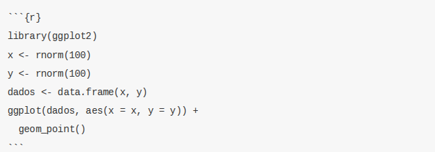

```{r, include=FALSE, warning=FALSE, message=FALSE}
knitr::opts_chunk$set(fig.align='center', fig.width = 7, fig.asp = 0.618,
                      out.width = '100%')
```

# RMarkdown

Antes de falarmos sobre o que é RMarkdown, é interessante discutirmos sobre o Markdown.

Markdown é uma linguagem de marcação, ou seja, não é uma linguagem de programação. Linguagens de marcação dizem como algo deve ser entendido, mas não têm capacidade de processamento e execução de funções. Por exemplo, HTML é uma linguagem de marcação. Ela apenas diz como uma página web está estruturada, mas não executa nenhum processamento. O Markdown, da mesma forma, apenas informa como um documento está estruturado.

No entanto, a vantagem do Markdown é a sua simplicidade e a possibilidade de utilização de uma linguagem comum para a criação de vários tipos de documentos. Por exemplo, um mesmo código Markdown pode ser convertido para HTML, LaTeX (gera pdf's), docx etc. Para isso, é necessário um conversor, que lê um código em Markdown e, considerando a escolha do _output_ desejado, converte o arquivo para a linguagem desejada. Isto ficará mais claro com os exemplos.

E o que é o RMarkdown? Nada mais é do que a possibilidade de executar-se scripts em R (além de outras linguagens) e incorporá-los a um arquivo Markdown (extensão `.md`). O pacote `knitr` executará "pedaços" (_chunk_) de códigos e gerará um arquivo `.md` com os códigos e seus resultados. Na sequência, o `pandoc`, que é um conversor, converte-o para a linguagem desejada, gerando os arquivos nos formatos escolhidos (.html, .docx, .pdf, .odt). A figura abaixo ilustra o processo:


Acesse [este link](http://rmarkdown.rstudio.com/formats.html) para ver os tipos de formatos disponíveis no RMarkdown. É possível gerar documentos no formato Word, pdf formatados para revistas científicas, apresentações, dashboards etc.

## Usos do RMarkdown

A seção anterior já deu algumas dicas sobre a utilidade do RMarkdown. Aqui elaboraremos um pouco mais sua funcionalidade.

1. **Reprodutibilidade**. Isto é importante quando um estudo é realizado. Pode ser que em algum momento após a realização do seu estudo outro analista/pesquisador deseje replicá-lo. Um documento que une o código às explicações pode ser fundamental neste momento.

2. **Compartilhamento de informação**. É possível que você tenha aprendido a usar um novo pacote e ache que ele pode ser interessante para outros colegas. Com o RMarkdown, você poderá criar um documento com exemplos de uso do pacote, facilmente compartilhável.

3. **Documentação de Rotinas**. A criação de rotinas para a realização de tarefas repetitivas é cada vez mais comum. No entanto, é importante que haja uma boa documentação da rotina para que você ou outro colega possa entender e dar manutenção à rotina no futuro.

4. **Relatórios parametrizados**. O RMarkdown facilita a criação de relatórios, inclusive dashboards, em que a estrutura é padrão, mas os dados dependem de um parâmetro. Por exemplo, relatórios de balança comercial por unidade da federação (UF). No caso, a UF seria um parâmetro que variaria de relatório para relatório.

## Estrutura de um RMarkdown

```{r echo = FALSE, comment = ""}
cat(htmltools::includeText("rmarkdown/primeiro_exemplo.Rmd"))
```

Vamos agora entender qual é a função de cada parte desse código.

**YAML (Configurações):**

```
---
title: "Primeiro Exemplo para o Curso de R"
author: "Paulo"
date: "`r format(Sys.time(), '%d de %B de %Y')`"
output:
  html_document: default
  pdf_document:
    fig_caption: yes
    fig_height: 3.5
    fig_width: 7
    number_sections: yes
lang: pt-br
---

```

O **YAML** é o responsável pelas configurações dos documentos. Basicamente, estamos informando qual é o título do documento, a data de criação, o nome do autor e o tipo de output que desejamos. No exemplo, está definido como output `pdf_document` e foram adicionadas opções para que as seções fossem numeradas e de tamanho das figuras. Caso quiséssemos um arquivo no formato Word (.docx), o output poderia ser modificado para `word_document`. Cada formato possui um conjunto de opções disponíveis. Nesse caso, é importante olhar-se a página de cada formato disponível na documentação do RMarkdown.

**Code Chunks**:



Os *Code Chunks*  são pedaços de código em R que podem ser executados para gerar resultados que serão incorporados ao documento. Você pode inserir um *chunk* manualmente ou com o atalho `CTRL + ALT + I`. Dentro de `{}` é possível incluir uma série de opções relacionadas à execução do código. Abaixo, falaremos sobre algumas dessas opções.

**Textos e Markdown**:


Na figura acima, é mostrado como o texto se mistura com o código de markdown. Esse código markdown, quando convertido, gerará a formatação desejada. Na próxima seção, detalharemos o que cada marcação faz.

## Renderizando um documento

Há duas formas de se renderizar um documento `.Rmd`. A primeira é via função `render()` do pacote `rmarkdown`.

```{r, eval=FALSE}
render(input, output_format = NULL, output_file = NULL, output_dir = NULL,
       output_options = NULL, intermediates_dir = NULL,
       runtime = c("auto", "static", "shiny"),
       clean = TRUE, params = NULL, knit_meta = NULL, envir = parent.frame(),
       run_pandoc = TRUE, quiet = FALSE, encoding = getOption("encoding"))
```

Veja no help a função de cada argumento. Essa função é especialmente importante quando a renderização de um RMarkdown está inserida dentro de uma rotina. Por exemplo, pode-se usar a função `render()` dentro de um loop para criar-se vários pdf's a partir de um relatório parametrizado.

A outra opção é usando o botão `knit`, disponível na interface do RStudio.


## Sintaxe

Abaixo estão os principais elementos de sintaxe do RMarkdown. Vários são autoexplicativos. Para alguns, faremos alguns comentários:

* **Cabeçalhos**:

```
# Cabeçalho de primeiro nível
## Cabeçalho de segundo nível
### Cabeçalho de terceiro nível
```

O resultado, em um documento com `output` definido como `pdf_document`, seria:


* **Estilo de texto**:

```
*Itálico* e **Negrito**
```
*Itálico* e **Negrito**

* Citações:

```
> Aqui vai um texto para citação
```

> Aqui vai um texto para citação

* **Código no texto**:

```
`mean(x)`
```

`mean(x)`

* **Código processado no texto:**

A opção abaixo é importante para que resultados do R possam ser incorporados diretamente ao texto do documento. Para demonstração, foi necessário darmos um espaço entre a aspa e o código, mas o correto é não haver esse espaço.

```
 ` r mean(c(2, 3, 4)) `
```

`r mean(c(2, 3, 4))`

* **Imagens:**

```
  
```

```
  
```

* **Listas não ordenadas:**

```
* Item a
* Item b
    + Subitem b1
    + Subitem b2
```

* Item a
* Item b
    + Subitem b1
    + Subitem b2
    
* **Listas ordenadas**:

```
1. Item 1
2. Item 2
3. Item 3
    i. Item 3a
    ii. Item 3b
```


1. Item 1
2. Item 2
3. Item 3
    i. Item 3a
    ii. Item 3b
 
* **Tabelas**: 

`--------:` indica que a Coluna 1 está alinhada à direita. `:------------:` indica que a coluna está centralizada. Alguns pacotes do R fornecem funções para a geração de tabelas a partir de `data.frames` e matrizes. Veja:

```
Coluna 1      | Coluna 2
-------------: | :-------------:
10  | Brasil
20  | China
Fonte: MDIC.
```

Coluna 1      | Coluna 2
-------------: | :-------------:
10            | Brasil
20            | China
Fonte: MDIC.

```
--------------------------------------------------------------------
Column 1                                                Column 2
------------------------------------------------------  ------------
I want the contents of this cell to fit into one line   Word1 Word2

------------------------------------------------------  ------------
```

--------------------------------------------------------------------
Column 1                                                Column 2
------------------------------------------------------  ------------
I want the contents of this cell to fit into one line   Word1 Word2

------------------------------------------------------  ------------

```{r}
x <- letters[1:3]
y <- LETTERS[1:3]
knitr::kable(data.frame(x, y), align = 'cc')
```


* **Links**:

```
Site do [MDIC](www.mdic.gov.br)
```

Site do [MDIC](www.mdic.gov.br)

* **Linha horizontal ou Quebra de Página**:

```
***
---
```

***
---

* **Equação**:

```
Modelo linear simples: $y_i = \alpha + \beta x_i + e_i$
```

Modelo linear simples: $y_i = \alpha + \beta x_i + e_i$

* **Equação em Bloco**:

```
Modelo linear simples: $$y_i = \alpha + \beta x_i + e_i$$
```

Modelo linear simples: $$y_i = \alpha + \beta x_i + e_i$$

## Opções de Chunk

Os chunks de códigos (`{r, ...}`) que possuem uma série de opções. Elencaremos aqui as principais. Para a lista completa, veja [este link](https://www.rstudio.com/wp-content/uploads/2015/03/rmarkdown-reference.pdf).

-------------------------------------------------------------------------------
 Opção         Valor Padrão       Descrição
------------ ----------------- ------------------------------------------------
eval          TRUE             Indica se o código deve ser executado

include       TRUE             Indica se o código deve ser exibido no documento final. Os resultados não serão apresentados.   

collapse      FALSE            Indica se o código e os resultados do chunk devem ser colapsados em um bloco único.

echo          FALSE            Indica se o código será exibido no documento final. Os resultados serão apresentados.

results      `markup`          Se `hide`, os resultados não serão exibidos. Se `hold`, os resultados serão exibidos ao final do chunk. Se `asis`, os resultados não serão formatados, sendo mostrados os resultados "brutos" (código html, tex, ...).

error         TRUE             Indica se mensagens de erros serão exibidas.

message       TRUE             Indica se mensagens geradas pelo código serão exibidas.

warning       TRUE             Indica se avisos gerados pelo código serão exibidos.

fig.cap       NULL             Título de gráfico referente ao chunk.

fig.height    7                Altura para gráficos criados pelo código (em polegadas).

fig.width     7                Largura para gráficos criados pelo código (em polegadas).
------------ ----------------- ------------------------------------------------

## Principais Formatos

### HTML

A HTML é a linguagem de marcação para construção de páginas web. Assim, se criarmos um documento e escolhermos como opção de output `html_document`, o resultado será uma página a ser aberta em browsers. Outros formatos do markdown, como _flexdashboard_ e _ioslides_, também geram páginas html. Cada tipo de formato tem um conjunto de aspectos específicos. Abaixo listamos os principais para html:

* A aparência e o estilo são definidos por um arquivo no formato [`css`](https://pt.wikipedia.org/wiki/Cascading_Style_Sheets). Isso impõe uma dificuldade adicional para a formatação do documento. O Rmarkdown fornece alguns temas e pacotes que também podem fornecer documentos com alguma formatação de estilo ([ver prettydoc](https://www.r-bloggers.com/creating-pretty-documents-with-the-prettydoc-package/));

* Único formato que aceita htmlwidgets (o próprio nome indica isso).

O código markdown incluído no arquivo `.Rmd` é convertido pelo pandoc, gerando um documento estruturado com código html. Vejamos abaixo o código em RMarkdown:


Após o processamento, será gerado o seguinte código html:


Esse código é interpretado pelo navegador e gera o seguinte resultado:


### PDF

Para a criação de PDFs pelo RMarkdown, utiliza-se o LaTeX (pronuncia-se: _Lah-tech_ or _Lay-tech_), que é um sistema de preparação de documentos muito utilizado pela comunidade científica. Inicialmente, o RMarkdown abstrai para o usuário a necessidade de saber-se essa linguagem. No entanto, como no HTML, se você quiser avançar na estrutura do documento e nos estilos será necessário aprender esta linguagem, pelo menos o suficiente para resolver o seu problema.

Entre as vantagens do LaTeX estão:

* Numeração automática de seções (e os demais níveis) e de equações;

* Criação automática de legendas com base em arquivos `.bib`;

* Facilidade de referências cruzadas no documento.

Como no caso do HTML, é possível usar templates. Isso é bastante útil para a criação de artigos científicos, que devem ser padronizados. Além disso, relatórios de instituições podem ser padronizados. Assim, basta que alguém crie um template e os demais poderão criar documentos com a mesma estrutura usando apenas o RMarkdown.

LaTeX é uma versão mais amigável de TeX. Ou seja, LaTeX é uma linguagem em um nível maior do que TeX. Como no R, existem diversos pacotes em LaTeX que fornecem comandos para facilitar a edição de alguma parte do documento. Por exemplo: o pacote `fancyhdr` fornece comandos que facilitam a construção de cabeçalhos e rodapés. Abaixo está um pequeno código para se ter uma noção sobre essa linguagem:

```
\documentclass{article}
\title{Exemplo 1}
\author{Nome do Autor}
\date{\today}
\begin{document}
  \maketitle
  \newpage
  \section{Introdução}
  Aqui vai o texto!
\end{document}

```

Basicamente, o código acima define a classe do documento como artigo, o título, o nome do autor e a data para o dia em que o documento for compilado. Depois, inicia-se o documento, criando o título (inclui título, autor e data), definindo uma quebra de página e a seção introdução.

#### Instalações necessárias

Para criar documentos PDF no RMarkdown é preciso ter uma instalação **TeX** disponível. Para isso, é preciso baixar uma distribuição compatível com o seu sistema operacional. [Nesta página](https://www.latex-project.org/get/) estão listadas as distribuições disponíveis por sistema operacional. No Windows é comum usar a distribuição MiKTeX.


#### Exemplo

Como no HTML, mostraremos primeiramente o código em RMarkdown: 


Esse código gerará um arquivo intermediário com a extensão `.tex`. Este arquivo terá o seguinte código:


Após a compilação, o seguinte documento é gerado:


### Word

A geração de word segue a geração dos demais formatos. No entanto, templates apenas funcionam para definir estilos que serão usados no documento. Atualmente, devido a limitações do conversor (pandoc), é difícil ter-se total acesso à formatação do documento.


## Excercícios

1. Crie um RMarkdown com o formato HTML para output. Neste documento, faça um mini tutorial sobre algum pacote que você aprendeu no curso ou outro pacote que você tenha conhecido. Crie as seções adequadamente e, se for o caso, crie tabelas.

2. Crie um novo RMarkdown e explique o processo de criação de um gráfico usando o ggplot2. O ideal é criar um novo gráfico, mas fique livre para utilizar algum exemplo deste material.

3. Utilizando o pacote `WDI`, crie uma visualização com o pacote `dygraphs` para a série de renda per capita do Brasil (`BRA`). Coloque um título no seu documento e faça com que o código não seja apresentado ao leitor.

4. A partir do exemplo anterior, crie um parâmetro chamado `country_code` no cabeçalho de configuração (`yaml`). Este parâmetro será usado para selecionar-se o país base para a visualização.

5. Crie um vetor com cinco códigos de países. A partir deste vetor, utilize a função render para criar um arquivo para cada país.

